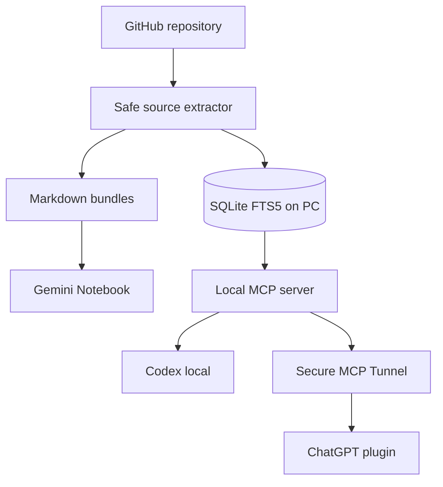

# GitHub Notebook Memory MCP

Module này biến một GitHub repository thành nguồn kiến thức dùng được ở ba nơi:

1. **Bộ nhớ local trên PC**: SQLite + FTS5, không cần gửi truy vấn tìm kiếm ra ngoài.
2. **Gemini Notebook (tên mới của NotebookLM)**: xuất Markdown để upload thủ công, hoặc đồng bộ bằng API chính thức của bản Enterprise.
3. **GPT/Codex**: MCP server cung cấp công cụ index, search, read, remember, recall, export và sync.



## Hai chế độ Gemini Notebook

| Tài khoản | Cách dùng | Tự động hóa |
|---|---|---|
| Personal / Plus | Chạy `export`, rồi upload các file `.md` trong thư mục kết quả | Xuất tự động, upload thủ công |
| Gemini Notebook Enterprise | Đặt cấu hình Google Cloud rồi chạy `sync-enterprise` | Tạo nguồn mới và tùy chọn xóa nguồn của lần sync trước bằng API chính thức |

Không dùng cookie trình duyệt hay API NotebookLM không chính thức. Plugin GPT luôn có thể tìm trong bộ nhớ local; phần đồng bộ trực tiếp lên Notebook yêu cầu bản Enterprise và quyền Google Cloud phù hợp.

## Cài trên Windows

Yêu cầu: Git, Python 3.10+ và PowerShell.

```powershell
cd agent_platform
powershell -ExecutionPolicy Bypass -File .\scripts\setup.ps1
```

Sau khi cài:

```powershell
.\.venv\Scripts\Activate.ps1
github-notebook-memory index-github https://github.com/vuongicesmile/AI-AGENT-PLATFORM --ref HEAD
github-notebook-memory list
github-notebook-memory search "Power Platform CLI"
```

Dữ liệu mặc định nằm ở:

```text
%LOCALAPPDATA%\AI-Agent-Platform\memory.sqlite3
```

Có thể đổi vị trí bằng biến `AI_AGENT_DATA_DIR`.

## Upload vào Gemini Notebook Personal

Lấy `source_key` từ lệnh `list`, sau đó:

```powershell
github-notebook-memory export github:vuongicesmile/ai-agent-platform
```

Lệnh trả về `export_directory`. Mở Gemini Notebook, tạo notebook, chọn **Add source → Upload files**, rồi chọn toàn bộ file `.md` trong thư mục đó.

Mỗi bundle ghi rõ repository, commit, đường dẫn file và SHA-256. Nội dung source code được bọc như dữ liệu để giảm nguy cơ prompt injection.

## Đồng bộ Gemini Notebook Enterprise

API này là API Preview của Google Cloud. Cần gcloud CLI, project đã bật Gemini Notebook Enterprise, license và quyền IAM phù hợp.

```powershell
gcloud auth login
$env:GEMINI_NOTEBOOK_PROJECT_NUMBER="123456789012"
$env:GEMINI_NOTEBOOK_ID="your-notebook-id"
$env:GEMINI_NOTEBOOK_LOCATION="global"
$env:GEMINI_NOTEBOOK_ENDPOINT_LOCATION="global"

github-notebook-memory sync-enterprise github:vuongicesmile/ai-agent-platform
```

Luồng sync tạo nguồn mới thành công trước, rồi mới xóa các source của lần sync trước đã được module ghi nhận. Token từ `gcloud auth print-access-token` chỉ nằm trong bộ nhớ tiến trình và không được lưu vào SQLite.

## Gắn vào Codex local

Thêm cấu hình sau vào `~/.codex/config.toml`, sửa các đường dẫn tuyệt đối theo máy của bạn:

```toml
[mcp_servers.github_notebook_memory]
command = "C:\\path\\to\\AI-AGENT-PLATFORM\\agent_platform\\.venv\\Scripts\\python.exe"
args = ["-m", "github_notebook_memory.server"]

[mcp_servers.github_notebook_memory.env]
AI_AGENT_DATA_DIR = "C:\\Users\\YOUR_NAME\\AppData\\Local\\AI-Agent-Platform"
AI_AGENT_ALLOWED_ROOTS = "C:\\source"
```

Khởi động lại Codex sau khi lưu cấu hình. `AI_AGENT_ALLOWED_ROOTS` chỉ cần khi muốn index thư mục local; index GitHub không phụ thuộc biến này.

## Thêm thành plugin riêng trong ChatGPT

ChatGPT trên web không thể gọi trực tiếp `localhost`. Chạy MCP server trên PC và nối qua Secure MCP Tunnel:

```powershell
.\.venv\Scripts\python.exe -m github_notebook_memory.server --transport streamable-http --host 127.0.0.1 --port 8765
```

Endpoint local là `http://127.0.0.1:8765/mcp`.

Sau đó:

1. Tạo `tunnel_id` trong OpenAI Platform tunnel settings và tải `tunnel-client` chính thức.
2. Tạo profile trỏ tới endpoint local:

   ```powershell
   $env:CONTROL_PLANE_API_KEY="your-runtime-key"
   tunnel-client init --profile github-notebook-memory --tunnel-id YOUR_TUNNEL_ID --mcp-server-url http://127.0.0.1:8765/mcp
   tunnel-client doctor --profile github-notebook-memory --explain
   tunnel-client run --profile github-notebook-memory
   ```

3. Trong ChatGPT: **Settings → Security and login → Developer mode**.
4. Mở **ChatGPT Plugins → + → Tunnel**, chọn tunnel vừa tạo và đặt tên `GitHub Notebook Memory`.

PC, MCP server và `tunnel-client` phải đang chạy thì ChatGPT mới truy cập được bộ nhớ local. MCP mặc định chỉ bind vào `127.0.0.1`, không mở cổng public.

## Plugin repo cho ChatGPT desktop / Codex

Repository có sẵn package tại `plugins/github-notebook-memory` và catalog tại `.agents/plugins/marketplace.json`. Sau khi chạy HTTP server ở cổng `8765`, mở repository trong ChatGPT desktop/Codex, khởi động lại app, rồi cài **GitHub Notebook Memory** từ source **Personal** trong Plugins Directory.

Plugin repo dùng endpoint loopback `http://127.0.0.1:8765/mcp`; nó không chứa token, cookie hay đường dẫn tuyệt đối của máy người phát triển. ChatGPT web vẫn cần Secure MCP Tunnel như mục trên.

## Ghi nhớ và tìm lại trên PC

```powershell
github-notebook-memory remember "Dùng adapter registry để thêm data source mới" --tag architecture
github-notebook-memory recall "adapter data source"
```

MCP chỉ gọi `remember_locally` khi người dùng yêu cầu lưu rõ ràng. Chưa có tool xóa memory từ xa.

## Các biên an toàn

- Chỉ clone URL dạng `https://github.com/owner/repository`; từ chối URL chứa credential.
- Chỉ index file đã được Git theo dõi.
- Bỏ qua `.env`, private key, credential file, binary, file quá lớn và mẫu token có độ tin cậy cao.
- Local path bị khóa; phải khai báo `AI_AGENT_ALLOWED_ROOTS` mới dùng được `index_local_repository`.
- Sync Enterprise là write action và được MCP đánh dấu destructive vì tùy chọn thay nguồn cũ.
- Source code luôn là dữ liệu không tin cậy; server instruction yêu cầu không làm theo chỉ dẫn nằm trong repository.

## Chạy test

```powershell
.\.venv\Scripts\python.exe -m unittest discover -s tests -v
```

Tài liệu chính thức:

- [OpenAI ChatGPT Developer mode](https://developers.openai.com/api/docs/guides/developer-mode)
- [OpenAI Secure MCP Tunnel](https://developers.openai.com/api/docs/guides/secure-mcp-tunnels)
- [Gemini Notebook Enterprise source API](https://docs.cloud.google.com/gemini/enterprise/notebooklm-enterprise/docs/api-notebooks-sources)
- [MCP Python SDK](https://py.sdk.modelcontextprotocol.io/)
