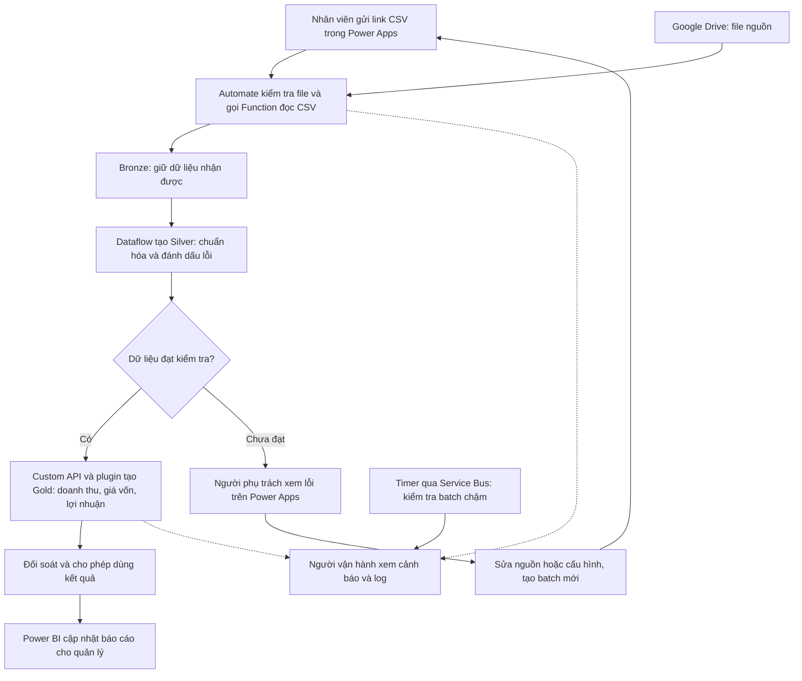

# Bài toán lớn: từ file bán hàng đến báo cáo đáng tin cậy

Ngày: 06/09/2026. Đọc tài liệu này trước [các bài thực hành](demo-learning-guide.vi.md). Cơ sở là [plan.md](../plan.md) và [8 yêu cầu kỹ thuật](requirment.md). Đây là overview thiết kế, chưa phải hệ thống đã triển khai.

## 1. Hệ thống giải quyết việc gì?

Bạn đang xây một nền tảng tiếp nhận, kiểm tra, xử lý và khai thác dữ liệu bằng Power Platform. Sales CSV là nghiệp vụ đầu tiên để học trọn luồng với dữ liệu nhỏ.

Hình dung tình huống minh họa: nhân viên có file bán hàng tháng 8 trên Google Drive. Người quản lý cần biết doanh thu, lợi nhuận và sản phẩm bán tốt. Người vận hành cần biết file đã xử lý chưa, lỗi nằm ở đâu và chạy lại có làm tăng số liệu không.

Nếu làm thủ công, người phụ trách có thể tải file, sửa ngày/số, ghép giá vốn rồi tổng hợp báo cáo. Các rủi ro cần giải quyết là đọc sai định dạng, bỏ mất dòng lỗi, cộng trùng file và không biết công thức/giá vốn nào đã tạo ra kết quả. Đây là tình huống minh họa, chưa phải kết quả khảo sát quy trình doanh nghiệp của bạn.

Kết quả mong muốn: **gửi một file → biết trạng thái xử lý → nhận số liệu đã kiểm tra → truy ngược được đến dữ liệu nguồn**.

## 2. Ai sử dụng?

| Vai trò đề xuất | Họ làm gì? | Họ nhìn thấy gì? |
| --- | --- | --- |
| Người gửi dữ liệu | Nhập link file và gửi xử lý | File của mình, trạng thái, thông báo cần sửa |
| Người phụ trách dữ liệu | Xem lỗi, xác nhận mã sản phẩm/khách hàng và nguồn giá vốn | Dòng lỗi, dữ liệu gốc, cấu hình được phân quyền |
| Người vận hành / developer | Điều tra lỗi kỹ thuật và thử lại khi đủ điều kiện | Run history, trace, thời gian xử lý, batch và lần chạy |
| Quản lý / analyst | Xem báo cáo và phân tích | Doanh thu, lợi nhuận theo tháng, sản phẩm, khách hàng |

Đây là các vai trò nghiệp vụ đề xuất. Ma trận quyền thực tế cần được cấu hình ở dữ liệu/API/báo cáo; ẩn một nút trên app chưa thực thi đầy đủ quyền.

## 3. Luồng đầu cuối

Sơ đồ raw nằm ở [demo-business-overview-flow.md](demo-business-overview-flow.md). Power Automate ghi Bronze sau khi nhận dữ liệu trả về từ Function. Nhánh Service Bus trong bài học chỉ chuyển tín hiệu kiểm tra batch chạy lâu.

| Bước | Diễn biến thực tế | Điều kiện / kết quả |
| --- | --- | --- |
| 1. Gửi | Nhân viên chọn file `Sales_2026_08.csv`, nhập link trong app | Tạo batch: một lô dữ liệu cần xử lý |
| 2. Tiếp nhận | Ghi nhận lần chạy, kiểm tra URL, quyền đọc và định dạng file | Link sai hoặc không đọc được phải có trạng thái/lỗi rõ ràng |
| 3. Lưu Bronze | Function đọc CSV; Automate lưu từng dòng raw | File hợp lệ 10 dòng phải có đủ 10 dòng Bronze |
| 4. Tạo Silver | Dataflow đổi ngày/số, kiểm tra mã, khoảng giá trị và trùng đơn | Mỗi dòng có kết quả Valid hoặc Error; dòng lỗi vẫn tồn tại |
| 5. Xử lý lỗi dữ liệu | Người phụ trách đọc lỗi và đối chiếu nguồn | Chính sách demo: batch còn lỗi chưa được công bố; nguồn/rule đổi thì tạo batch mới |
| 6. Tạo Gold | Automate gọi Custom API; plugin áp dụng giá vốn và công thức | Ghi kết quả tạm chờ đối soát, có liên kết về dòng Silver |
| 7. Đối soát | So số dòng, key và tổng tiền giữa các bước | Chỉ cho sử dụng kết quả khi các kiểm tra đều đạt |
| 8. Báo cáo | Power BI đọc Gold đủ điều kiện và cập nhật báo cáo | Quản lý xem doanh thu, lợi nhuận, thời điểm dữ liệu mới nhất |
| 9. Theo dõi | App hiển thị trạng thái/lỗi; watchdog phát hiện batch quá lâu | Người vận hành biết bước bị kẹt và lần chạy cần điều tra |
| 10. Thử lại / thay đổi | Lỗi mạng được thử lại có kiểm soát; dữ liệu sửa đi theo phiên bản mới | Không nhân đôi số liệu hoặc làm mất bằng chứng cũ |

Gold xử lý xong và báo cáo cập nhật xong là hai mốc cần theo dõi riêng. Báo cáo refresh lỗi thì xử lý bước báo cáo, tránh chạy lại cả file chỉ để cập nhật màn hình.

## 4. Ba tầng Đồng – Bạc – Vàng có ý nghĩa gì?

**Bronze trả lời “nguồn đã gửi gì?”. Silver trả lời “dữ liệu có đúng kiểu và đạt quy tắc không?”. Gold trả lời “nghiệp vụ cần sử dụng những số liệu nào?”.**

Ví dụ SO001 lấy từ fixture của repo, giá vốn demo cho một sản phẩm là 700 USD:

| Tầng | Dữ liệu của cùng dòng SO001 | Ứng dụng |
| --- | --- | --- |
| Bronze — Đồng | Date = `01/08/2026`, Qty = `"2"`, Unit Price = `"1000"`, Discount = `"5%"` | Xem lại giá trị nhận từ nguồn; giữ hash/thông tin file để truy vết |
| Silver — Bạc | Ngày được hiểu là 1/8/2026; Quantity = 2; UnitPrice = 1000; DiscountPct = 0.05 | Kiểm tra số lượng dương, giảm giá trong khoảng cho phép, mã khách hàng/sản phẩm hợp lệ |
| Gold — Vàng | Doanh thu thuần = 1900; giá vốn = 1400; lợi nhuận = 500; tỷ suất khoảng 26,3158% | Làm dữ liệu đầu vào cho báo cáo kinh doanh |

Gold có thể chứa kết quả theo từng đơn/dòng; báo cáo tiếp tục tổng hợp theo tháng, sản phẩm, khách hàng. Công thức và giá vốn demo cần được nghiệp vụ xác nhận trước khi dùng thật.

Trong thiết kế hiện tại, **cả ba tầng nằm trong Dataverse**. Dev/Test/Prod là các môi trường triển khai riêng; mỗi môi trường có đủ ba tầng.

## 5. Các yêu cầu nghiệp vụ cần làm thật

| Yêu cầu | Áp dụng vào demo | Bằng chứng hoàn thành | Nguồn plan |
| --- | --- | --- | --- |
| Tiếp nhận đúng nguồn | URL Drive, quyền đọc, CSV/header/metadata | File đúng được nhận; file sai bị từ chối có lý do | 5 |
| Giữ nguồn và truy vết | Batch, lần chạy, hash, row key và raw | Từ Gold tìm được Silver, Bronze và đúng phiên bản nguồn | 4, 12 |
| Kiểm tra chất lượng | Ngày, số, giảm giá, currency, master, đơn trùng | Qty âm hoặc Discount 150% có lỗi cụ thể và không biến mất | 6–7 |
| Tính đúng nghiệp vụ | Giá vốn, doanh thu, lợi nhuận, làm tròn | SO001 cho NetSales 1900 và Profit 500 theo fixture | 8–10 |
| Chạy lại không trùng | Key ổn định và phân biệt lần thử | Cùng batch thử lại vẫn 10 dòng, doanh thu không tăng gấp đôi | 12, 15 |
| Đối soát trước công bố | Kiểm tra đủ dòng và tổng tiền | Chưa đưa một phần Gold đang tính vào báo cáo | 17; chi tiết bổ sung trong kế hoạch triển khai |
| Báo cáo dùng được | Power BI đọc Gold đã công bố | Người xem đúng quyền mở được report và nhìn thấy batch mới | 16–17 |
| Vận hành được | Lỗi có người xử lý, log có định danh, phát hiện batch chậm | Tìm được nguyên nhân và xử lý đúng bước | 4.2–4.3, 15 |
| Phân quyền và triển khai | Quyền theo vai trò, cấu hình theo environment, source trong Git | Kiểm thử quyền và dựng lại trên Test từ artifact | 13–14, 18 |

Batch nghĩa là một lô đầu vào cùng cấu hình đã chọn. Run nghĩa là một lần thử chạy lô đó. Cùng file và cấu hình thử lại do lỗi mạng: lần chạy mới của cùng batch. Sửa nội dung file hoặc quy tắc: batch/phiên bản mới; khi phát triển bản đầy đủ phải xác định bản nào thay thế bản nào để báo cáo không cộng cả hai.

## 6. Tám yêu cầu kỹ thuật của bạn được dùng ở đâu?

| Yêu cầu | Tình huống thực tế | Chức năng trong bài học |
| --- | --- | --- |
| Debugger, error, log | Bấm nút không chạy; plugin sai dữ liệu; flow bị lỗi kết nối | Xem Console, Plugin Trace, Run history và Application Insights; tìm theo batch/lần chạy |
| Field notification | Nhân viên nhập nhầm link hoặc thay đổi URL chưa lưu | Báo cạnh ô để sửa sớm; server vẫn kiểm tra lại khi nhận yêu cầu |
| Command button | Người dùng cần thao tác rõ ràng trên batch đang mở | Nút Theo dõi batch; các thao tác retry tương lai phải kiểm tra quyền và trạng thái |
| Xrm navigation + custom page | Muốn xem ngay tiến trình và lỗi của đúng file đang chọn | Mở Batch Console và truyền ID batch; người dùng không tự gõ GUID |
| Plugin | Dữ liệu có thể được ghi từ app, flow hoặc API | Kiểm tra quy tắc phía server; API tính Gold dùng một công thức chung |
| Azure Function / schedule | Cần đọc CSV đúng cấu trúc và kiểm tra xử lý định kỳ | HTTP Function đọc CSV; Timer phát tín hiệu kiểm tra batch chậm |
| Custom connector | Flow cần gọi HTTP API bằng các ô input/output rõ ràng | Action ParseSalesCsv tái sử dụng qua connection được cấu hình |
| Service Bus / Automate | Các bước cần điều phối; tín hiệu kiểm tra cần chờ lúc bên nhận tạm ngừng | Automate nối pipeline; Service Bus giữ tín hiệu watchdog để flow nhận và xử lý |

Custom page là phần giao diện linh hoạt nằm trong model-driven app, có thể mở qua Client API. Thiết kế Batch Console dùng khả năng này. [Microsoft: custom pages](https://learn.microsoft.com/en-us/power-apps/maker/model-driven-apps/model-app-page-overview).

Dataflow dùng Power Query chuẩn bị dữ liệu và có thể nạp kết quả vào Dataverse; đó là bước Silver của thiết kế. [Microsoft: tạo và dùng dataflows](https://learn.microsoft.com/en-us/power-query/dataflows/create-use).

Với Service Bus peek-lock, bên nhận xác nhận sau khi xử lý; message có thể được giao lại nên flow phải chống ghi trùng cảnh báo. Queue chỉ giữ message theo cấu hình và thời hạn của nó, không tự sửa dữ liệu lỗi. [Microsoft: delivery và xử lý trùng](https://learn.microsoft.com/en-us/azure/service-bus-messaging/service-bus-message-loss-and-duplicates).

Azure Functions và Service Bus là dịch vụ Azure tích hợp với Power Platform. Trong bài này, chúng có nhiệm vụ cụ thể là đọc CSV và hỗ trợ theo dõi xử lý.

## 7. Từ bài học đến ứng dụng thực tế

Demo dùng 10 dòng để kiểm chứng đầy đủ đường đi. Bản vận hành thực tế còn phải có nguồn master/giá vốn được xác nhận, chính sách sửa số liệu đã công bố, phân quyền, kiểm soát nhiều lần chạy đồng thời, đo hiệu năng và quy trình Dev → Test → Prod.

Các hướng mở rộng dưới đây là ví dụ ứng dụng, chưa bổ sung thành phạm vi đã cam kết:

| Khi nghiệp vụ cần | Áp dụng mô hình |
| --- | --- |
| Đơn có nhiều sản phẩm | Bổ sung mã dòng đơn và định nghĩa lại key trước khi tổng hợp |
| Đối tác gửi dữ liệu | Power Pages làm cửa gửi; giữ chung quy tắc tiếp nhận và kiểm tra |
| Nhân viên nhập tại hiện trường | Canvas App làm giao diện nhập; dữ liệu vẫn đi qua validation và lưu vết |
| Nguồn là PDF/ảnh hóa đơn | Đánh giá AI Builder trích xuất và bước kiểm tra kết quả trước khi chuẩn hóa |
| Người vận hành muốn hỏi bằng hội thoại | Copilot Studio gọi API được phân quyền để hỏi batch lỗi hoặc tình trạng báo cáo |
| Nghiệp vụ điện/nước, checklist | Tái sử dụng tiếp nhận, raw, chuẩn hóa, tính chỉ số và truy vết; xác nhận riêng nguồn, đơn vị và công thức |

## 8. Kịch bản nên hiểu trước khi bấm thử

1. **Dòng đúng:** SO001 đi từ raw sang dữ liệu chuẩn, rồi thành doanh thu 1900 và lợi nhuận 500.
2. **Dòng sai:** Qty = -2 vẫn có ở Bronze, xuất hiện Error ở Silver, batch chưa được dùng cho báo cáo theo chính sách demo.
3. **Lỗi mạng:** người vận hành xác nhận bước cũ đã dừng rồi thử lại cùng input; số liệu không nhân đôi.
4. **Batch chậm:** watchdog lưu cảnh báo để điều tra; không tự khởi chạy thêm một worker trên cùng batch.
5. **Báo cáo chưa mới:** kiểm tra lần refresh và batch đã có trên report; không mặc định Gold sai.

Kết quả kỳ vọng của CSV chuẩn và master fixture: Bronze 10, Silver Valid 10, Gold 10; tổng Net Sales **8.693 USD**, Gross Profit **3.403 USD**. Đây là số kỳ vọng để kiểm thử, chưa phải kết quả chạy tenant.

Mốc thực hành đầu tiên là một màn hình Batch cho phép nhập URL, gửi yêu cầu và xem trạng thái. Sau đó nối Bronze, Silver, Gold và Power BI theo [lộ trình bài học](demo-learning-guide.vi.md) và [kế hoạch triển khai đầy đủ](sales-data-platform-implementation-plan.vi.md).
