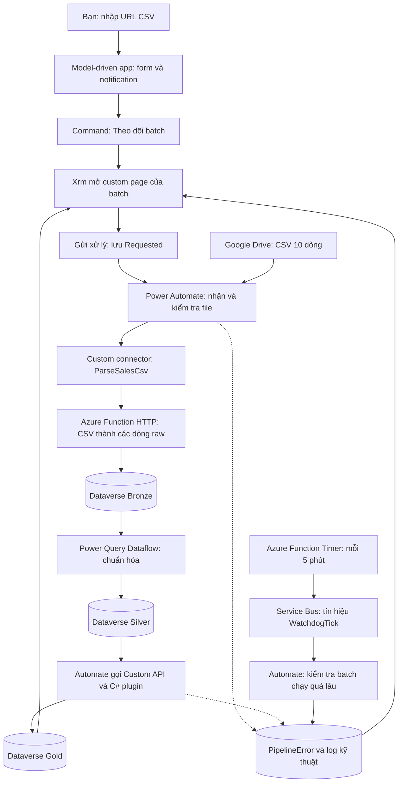

# Học Power Platform qua Sales Data Platform Demo

Ngày: 06/09/2026. Đây là **thiết kế và hướng dẫn thực hành** dựa trên [8 yêu cầu của bạn](requirment.md), [plan.md](../plan.md) và [solution đã kiểm tra](pac-connection-status.vi.md). **Cập nhật checkpoint:** app đã publish; plugin/Functions có code local, pipeline chưa chạy end-to-end. Xem [nhật ký implementation](demo-implementation-journal.vi.md) và [hướng dẫn tiếp tục](demo-resume.vi.md) để phân biệt thiết kế với phần đã làm thật.

Để biết mình đã đọc gì, phát hiện gì và vì sao thiết kế như vậy, xem [nhật ký thực hiện và giải thích](demo-design-journal.vi.md).

Trước khi làm bài, đọc [overview nghiệp vụ và luồng đầu cuối](demo-business-overview.vi.md) để hiểu ai dùng hệ thống, ba tầng dữ liệu có ý nghĩa gì và từng yêu cầu kỹ thuật áp dụng vào đâu.

## 1. Bạn sẽ làm được gì?

Bạn mở app **Sales Demo**, tạo một batch và nhập link CSV Google Drive. Form thông báo ngay nếu link sai. Bấm **Theo dõi batch** để mở custom page. Bấm **Gửi xử lý** để chạy luồng Bronze → Silver → Gold. Nếu lỗi, bạn biết xem log ở đâu. Một timer gửi tín hiệu qua Service Bus để Power Automate kiểm tra batch chạy quá lâu.

Một **batch** là một lô dữ liệu, ở đây là một file CSV 10 dòng. **RunKey** nhận diện lần thử xử lý lô đó. Các bài đầu dùng một batch và một người thao tác để dễ quan sát.

| Yêu cầu trong `requirment.md` | Áp dụng vào demo | Đọc và làm |
| --- | --- | --- |
| Debugger, error và log | F12 cho form; Plugin Trace Log cho C#; Run history cho flow; Application Insights cho Function | [Bài 1](demo-lab-01-ui.vi.md#bài-1--debugger-error-và-log) |
| Field notification khi thay đổi | Ô URL báo lỗi khi nhập sai; thông báo chưa lưu khi sửa | [Bài 2](demo-lab-01-ui.vi.md#bài-2--field-notification-khi-sửa-url) |
| Command button | Nút **Theo dõi batch** trên form Pipeline Batch | [Bài 3](demo-lab-01-ui.vi.md#bài-3--thêm-command-button) |
| Xrm navigation tới custom page | Truyền GUID của batch vào trang **Batch Console** | [Bài 4](demo-lab-01-ui.vi.md#bài-4--custom-page-nhận-đúng-batch) |
| Plugin | Validation phía server và Custom API tính Gold | [Bài 5](demo-lab-02-plugin.vi.md) |
| Azure Function và schedule | HTTP Function đọc CSV; Timer phát tín hiệu kiểm tra batch | [Bài 6](demo-lab-03-azure.vi.md#bài-6--azure-functions-http-và-timer) |
| Custom connector | Biến HTTP API đọc CSV thành action dễ gọi trong flow | [Bài 7](demo-lab-03-azure.vi.md#bài-7--custom-connector-gọi-function) |
| Service Bus và Automate | Automate điều phối dữ liệu; queue chuyển tín hiệu watchdog từ Timer | [Bài 8](demo-lab-04-automation.vi.md) |

**Thứ tự thực hành:** chuẩn bị app → bài 1–4 → bài 5 với một dòng Silver nhập tay → bài 6–7 → bài 8 với CSV 10 dòng. Khi Gold của một dòng còn chưa đúng, chưa cần chạy cả file.

## 2. Sơ đồ dễ hình dung

Mũi tên Function → Bronze biểu diễn dữ liệu trả về cho flow; **Power Automate thực hiện ghi Bronze**. Function đọc CSV không cần quyền Dataverse. Service Bus trong bài này vận chuyển tín hiệu kiểm tra, còn luồng xử lý file vẫn do Automate điều phối.

## 3. Những gì đã có và cần bổ sung

Solution hiện tại là **SalesDataPlatformDemo**, Unmanaged, prefix **sdp**. Snapshot ngày 06/09 có năm bảng sau; các cột trạng thái đều là **Text**. Ba tầng là ba bảng trong cùng environment.

| Bảng thật | Dùng trong bài học |
| --- | --- |
| `sdp_pipelinebatch` | URL, tên file, BatchKey, RunKey, trạng thái và số dòng mỗi tầng |
| `sdp_pipelineerror` | BatchKey, RecordKey, Layer, ErrorType, ErrorMessage |
| `sdp_salesbronze` | RowNumber, OrderId, RawJson, LoadStatus |
| `sdp_salessilver` | Dữ liệu kiểu số/ngày, DataQualityStatus và thông báo lỗi |
| `sdp_salesgold` | NetSales, Cost, GrossProfit, GrossMarginPct, ReportStatus |

Các bảng **chưa có lookup giữa nhau** trong snapshot. Ở bài học, lọc theo `sdp_batchkey`; không tạo subgrid quan hệ rồi kỳ vọng nó tự lọc. Bản triển khai đầy đủ sẽ bổ sung quan hệ và tách DataSource/ProcessingBatch/PipelineRun như [kế hoạch tổng thể](sales-data-platform-implementation-plan.vi.md).

Các giá trị trạng thái **đề xuất cho bài học**, chưa phải Choice đã tạo:

| Trạng thái batch | Ý nghĩa |
| --- | --- |
| `New` | Đã nhập, chưa gửi |
| `Requested` | Người dùng đã gửi yêu cầu |
| `Processing` | Flow đang đọc file hoặc ghi Bronze |
| `Transforming` | Dataflow đang chuẩn hóa Silver |
| `Calculating` | Plugin đang tính Gold |
| `Completed` | Đối soát xong, dữ liệu được phép xem |
| `Failed` | Có lỗi; đọc PipelineError trước khi thử lại |

Không dùng `Completed` của batch để nói solution đã publish/deploy. Đó là hai việc khác nhau.

## 4. Chuẩn bị một lần trước khi làm bài

1. Mở Power Apps → chọn environment đã kết nối PAC → **Solutions → SalesDataPlatformDemo**. Kiểm tra đúng solution theo Name; tên hiển thị có thể được đổi khi thực hành.
2. Mở **Tables → SDP Pipeline Batch → Forms → Main form**. Thêm các cột: Name, BatchKey, RunKey, SourceUrl, Status, FileName, BronzeCount, SilverCount, GoldCount, ErrorCount. Đối chiếu tên hiển thị với logical name trong [bảng cấu hình bên dưới](#5-quy-ước-dữ-liệu-cho-demo).
3. Giữ SourceUrl ở vị trí luôn nhìn thấy. Sau này `setNotification` trên một control bị ẩn có thể chặn lưu nhưng người dùng không thấy lỗi.
4. Trong solution, **New → App → Model-driven app**, đặt tên hiển thị **Sales Demo**. Thêm trang bảng cho cả năm bảng. Nhóm điều hướng thành **Batch**, **Dữ liệu**, **Lỗi**.
5. Save và Publish app trong environment thực hành khi bạn triển khai bài này. Mở app để chắc chắn thấy danh sách Batch và form của nó.
6. Tạo một batch mẫu: Name `Demo 01`, BatchKey `demo01`, RunKey `run01`, Status `New`. Chỉ sử dụng key gồm chữ, số, gạch ngang/gạch dưới trong bài học.
7. Tạo **alternate key** trên `sdp_batchkey` của PipelineBatch và trên `sdp_recordkey` của Bronze/Silver/Gold/PipelineError. Vào từng table → **Schema → Keys → New key**; chờ trạng thái **Active**. Nếu có dữ liệu trùng, kiểm tra và xử lý trước; không xóa hàng loạt để ép key hoạt động.
8. Thêm ba cột mới đề xuất trên PipelineBatch: `sdp_startedon` và `sdp_silverrequestedon` kiểu Date and time, `sdp_silverrunkey` kiểu Text. Dùng User local cho thời gian và lưu UTC qua API. Flow đặt StartedOn một lần khi bắt đầu mỗi RunKey; watchdog không dùng `modifiedon` làm thời điểm bắt đầu. Hai cột Silver dùng đối chiếu callback Dataflow.
9. Trong **environment variables** của solution, chuẩn bị cấu hình demo: ngưỡng category High `2000`, Medium `1000` theo `plan.md`; chi phí và customer/product master lấy từ [master-data.json](../repositories/rmit-fm-integrations/demo/sales-data-pipeline/config/master-data.json). Có thể lưu JSON demo trong biến Text `sdp_DemoMasterDataJson`. Đây là fixture học tập, chưa phải nguồn giá vốn nghiệp vụ.
10. Upload bản sao [CSV mẫu](../data/sample_sales_2026_08.csv) lên Drive với tên **Sales_2026_08.csv**, rồi lấy link file thật. File local/mock ID không phải file đã có trên Drive.
11. Mở cột Gold `sdp_grossmarginpct`: snapshot hiện có precision **4**. Để lưu đúng kết quả code mẫu, đề xuất đổi precision thành **6** trước bài plugin; các số tiền vẫn precision 4. Đây là thay đổi cần thực hiện khi làm bài, chưa được sửa trên tenant.

App cần quyền đọc các bảng; người nhập cần quyền tạo/sửa Batch; tài khoản flow cần quyền các bảng xử lý và quyền execute API tương ứng. Chưa suy ra các quyền này chỉ từ việc PAC đọc được solution. Phần Azure cần subscription và quyền tạo Function/Service Bus; license Power Platform không tự tạo những tài nguyên đó.

## 5. Quy ước dữ liệu cho demo

| Dữ liệu | Quy ước |
| --- | --- |
| ID của dòng Dataverse | GUID thật, dùng khi Xrm mở custom page hoặc gọi API theo record |
| BatchKey | `demo01`, nhận diện lô; lưu trong `sdp_batchkey` |
| RunKey | `run01`, nhận diện một lần thử; không đổi giữa các action trong cùng lần chạy |
| Bronze/Silver RecordKey | `demo01-r0001`…`demo01-r0010`; dựa trên dòng CSV, không dựa vào OrderId có thể lỗi/trùng |
| Gold RecordKey | Cùng key lineage của Silver trong bài học; chỉ tạo sau khi toàn bộ OrderId trong batch được kiểm tra trùng |
| Error RecordKey | Ví dụ `demo01-run01-r0001-invalidqty`; lỗi khác/một lần thử khác có key riêng |
| Status / Quality / ReportStatus | Text, phân biệt đúng chuỗi: `Valid`, `Error`, `Candidate`, `Ready` |
| Giảm giá | `5%` trong CSV chuyển thành số `0.05` ở Silver |
| Định dạng ngày | `01/08/2026` nghĩa là 1 tháng 8; parse theo `dd/MM/yyyy` |
| Tiền tệ | Chỉ USD trong fixture; các cột số tiền hiện là Decimal, không phải kiểu Money |

Key phải được Dataverse tạo index thành công mới bảo đảm uniqueness. Giữ nguyên input/master/rule cho một BatchKey. File hoặc rule thay đổi thì tạo batch mới. Retry cùng input giữ RecordKey để tránh tạo dòng trùng. Bài học chưa có cơ chế version và lock đầy đủ để chạy nhiều batch đồng thời.

## 6. Bài nào hoàn thành thì kiểm tra ngay bài đó

| Mốc | Bạn phải nhìn thấy |
| --- | --- |
| UI | Link sai báo lỗi; sửa đúng hết lỗi; nút mở đúng batch |
| Plugin | Quantity âm bị từ chối ở server, có trace; dòng hợp lệ tính Gold đúng |
| HTTP / Connector | CSV một dòng trả về JSON một dòng; header sai trả lỗi 400 |
| Luồng đầy đủ | CSV chuẩn: Bronze 10, Silver 10, Gold 10, batch Completed |
| Watchdog | Batch thử nghiệm chạy quá ngưỡng sinh cảnh báo; delivery lặp không tạo thêm cùng cảnh báo |
| Repo / ALM | Sau publish, export sang snapshot mới và diff với baseline; [chạy status PAC](pac-connection-status.vi.md) |

Kết quả tiền của CSV chuẩn, dùng đúng giá vốn fixture: **Net Sales = 8.693 USD**, **Gross Profit = 3.403 USD**. Riêng dòng SO001: Gross Sales 2.000, Discount 100, Net Sales 1.900, Cost 1.400, Profit 500 USD, Margin khoảng 26,3158%.

Các bài học bổ sung cho `plan.md`, không đánh dấu các FR/NFR của dự án FM là đã hoàn thành. Sau khi bài học chạy được, mới áp dụng đầy đủ batch version, quan hệ, lock, quyền, staging/publish và ALM trong kế hoạch tổng thể.
