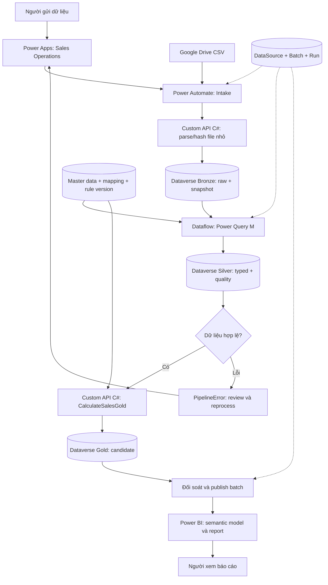

# Kế hoạch triển khai Sales Data Platform

Ngày: 2026-09-05. Trạng thái: đề xuất cho research/dev; chưa triển khai lên tenant.

Cơ sở: [plan.md](../plan.md), CSV mẫu và source hiện có. Người dùng có license Power Platform; tên gói, capacity và environment cụ thể chưa xác minh. Các lựa chọn trong tài liệu là đề xuất triển khai, không phải quyết định production đã được duyệt.

Phạm vi là Sales CSV. `AGENTS.md` và tên repository còn mang ngữ cảnh RMIT FM; không tự chuyển KPI/SLA/approval/FR-NFR của FM thành requirement Sales. Traceability dùng số mục của `plan.md`.

## 1. Kết quả đầu cuối

Người dùng nhập URL Google Drive trong Power Apps, nhận RunId, theo dõi dữ liệu đi qua ba tầng, xử lý lỗi và xem báo cáo. Người vận hành có thể retry an toàn và truy một số liệu Gold về đúng Silver row, Bronze row và phiên bản file gốc.

**Bronze, Silver, Gold là ba nhóm bảng Dataverse trong cùng environment. Dev, Test, Prod là ba môi trường triển khai riêng.** Mỗi environment có đầy đủ ba tầng. Fabric/OneLake không là dependency của thiết kế hiện tại.

MVP dùng một CSV 10 dòng, USD, một dòng/OrderId như fixture. Các giả định này cần mở rộng có kiểm soát trước dữ liệu nghiệp vụ khác.

## 2. Thành phần Power Platform và trách nhiệm

| Thành phần | Trách nhiệm | Thời điểm |
|---|---|---|
| Power Apps model-driven | Sales Operations: file, run, lỗi, master data, mapping, retry | MVP |
| Canvas/custom page + Power Fx | Form nhập URL và tiến trình nếu form chuẩn chưa đủ | Theo nhu cầu UX |
| Dataverse | Ba tầng dữ liệu, quan hệ, alternate key, config/version, audit, publish state | MVP |
| Power Automate cloud flows | Intake, điều phối các stage, retry, email, refresh report | MVP |
| Power Apps standard Dataflow + Power Query M | Bronze → Silver: chuẩn hóa, kiểm tra chất lượng | MVP |
| Custom API + C# Plugin | Parse/hash file nhỏ, tính Gold, upsert và kiểm soát trạng thái | MVP |
| Power BI | Semantic model, DAX, RLS, report trên Gold đã công bố | MVP |
| Solutions + PAC CLI + Git + Pipelines | Source control, đóng gói và Dev → Test → Prod | Thiết lập từ đầu |
| Copilot Studio | Hỏi run/lỗi, truy dữ liệu được phép, yêu cầu retry qua tool | Sau MVP |
| AI Builder | PDF/ảnh hóa đơn → extracted payload có confidence → review | Khi thêm nguồn tài liệu |
| Power Pages | Portal gửi dữ liệu cho đối tác bên ngoài | Khi có external audience |
| Code Apps/PCF | Mapping editor hoặc lineage UI phức tạp | Khi UI chuẩn không đáp ứng |

Power Fx/Business Rules giúp validation sớm ở UI; quy tắc tài chính và quyền vẫn được kiểm tra ở backend. Business Process Flow có thể hướng dẫn người review; cloud flow/API thực hiện chuyển stage kỹ thuật. Desktop flow chỉ nghiên cứu khi nguồn thực sự không có connector/API/export phù hợp.



## 3. Những điểm cần hoàn thiện trong plan gốc

| Điểm hiện tại | Điều chỉnh đề xuất |
|---|---|
| Tạo PipelineRun sau download | Tạo trước validation/external call để URL sai cũng có audit |
| URL contains drive.google.com | Parse URI, HTTPS, hostname chính xác và format file ID |
| Hai key Bronze khác nhau ở mục 5 và 12 | Thống nhất DataSourceId + RowNumber |
| Silver key dựa trên OrderId | Dùng lineage key để giữ được cả dòng thiếu/trùng OrderId |
| Retry và thay đổi rule chưa tách biệt | Thêm ProcessingBatch cố định input và version; PipelineRun là attempt |
| Raw schema thiếu code riêng | Giữ CustomerCodeRaw, ProductCodeRaw từ CSV, không suy code từ tên |
| CostPerUnit chưa có nguồn chính thức | Master ProductCost có version; fixture chỉ dùng demo |
| Gọi refresh Silver rồi chạy Gold | Chờ completion, kiểm tra đúng attempt và đối soát output |
| Gold được ghi trực tiếp cho báo cáo | Ghi candidate và có gate publish cả batch |
| Mọi artifact dùng chung ALM/config | Dataflow và Power BI có deployment steps riêng |

File local `sample_sales_2026_08.csv` giữ nguyên làm fixture; upload bản tên `Sales_2026_08.csv` để qua quy tắc tên của happy path.

## 4. Research spike trước khi build

| Spike | Cần kiểm chứng thực tế |
|---|---|
| License/environment | Quyền tạo solution, bảng, flow, dataflow; Power BI publish/share; không suy từ một license thành mọi entitlement |
| Google Drive | Đọc metadata/content của file owned/shared đúng use case, xử lý 403/404, policy cho phép Drive → Dataverse |
| CSV | UTF-8/BOM, CRLF/LF, quoted comma, escaped quote, quoted newline, header sai |
| Dataflow | Upsert key, mapping lookup/quality, giữ dòng invalid, callback và correlation |
| Plugin | PAC scaffold, target framework, dependencies, đăng ký và gọi API từ flow |
| Power BI | Dataverse connector, TDS/permission, Import và Viewer access |
| ALM | Import thử solution chứa Dataflow sang Test, rebind và identity triển khai |

Google Drive connector có action metadata/content và giới hạn content công bố là 10 MB. Giới hạn file của project phải theo mức nhỏ nhất của connector, request API và parser đã đo; không coi 10 MB là cam kết cho plugin. [Microsoft: Google Drive connector](https://learn.microsoft.com/en-us/connectors/googledrive/)

## 5. Data model và định danh

Ba khái niệm phải tách:

- **DataSource**: phiên bản nội dung nguồn; đổi bytes thì có version mới, giữ hash và snapshot.
- **ProcessingBatch**: input + MappingVersion + MasterVersion + RuleVersion + CorrectionVersion được ghim. Retry dùng lại batch; sửa rule hoặc dữ liệu tạo batch mới.
- **PipelineRun**: một lần thử xử lý batch; có AttemptNo/AttemptToken, stage, counters và lỗi riêng.

Run được tạo trước khi gọi Drive, lưu SubmittedUrl; DataSource lookup có thể null trong intake. Reject vẫn ghi source/error với thông tin đã thu được. Nguồn hợp lệ được canonicalize theo file ID/hash trước khi load Bronze.

| Bảng | Nội dung |
|---|---|
| DataSource | SourceSystem, FileId, FileHash, URL, metadata, OriginalFile, SchemaVersion |
| ProcessingBatch — thêm | BatchKey, SourceId, các version, ProcessingStatus, PublishStatus, PublishedOn |
| PipelineRun | BatchId, AttemptNo/Token, stage, counts, thời gian, ReportingStatus |
| PipelineError | Run/Batch, Layer, RowNumber/RecordKey, ErrorCode, Severity, resolution |
| PipelineControl — thêm | Một hàng/pipeline: active batch/run, lease token, heartbeat, Dataflow ID |
| Sales_Bronze | SourceId, logical RowNumber, toàn bộ raw fields, RawJson, parser/schema version |
| Sales_Silver | BatchId, BronzeId, RowNumber, typed data, QualityStatus/Message, AttemptToken |
| Sales_Gold | BatchId, SilverId, business key, fact values, cost/rule references |
| DataMapping | Version, SourceColumn, TargetColumn, RuleCode, Priority |
| SalesCustomer — thêm | CustomerCode, tên, trạng thái và version |
| SalesProduct — thêm | ProductCode, tên, đơn vị và version |
| ProductCost — thêm | ProductCode, Currency, CostPerUnit, effective dates và version |
| RuleSet — thêm | Version, parsing/rounding/category rules, quality policy |

Master/config release đã dùng phải bất biến; sửa bằng version mới. Gold lưu giá vốn đã dùng và reference/version để tái hiện được kết quả.

| Đối tượng | Key đề xuất |
|---|---|
| Source hợp lệ | SourceSystem + GoogleDriveFileId + FileHash |
| Batch | Hash của input version + các config/master/rule/correction version |
| Bronze | DataSourceId + RowNumber |
| Silver | BatchId + RowNumber, có thể materialize thành LineageKey text |
| Gold candidate | BatchId + SourceBusinessKey, có thể materialize thành GoldKey text |
| Run | RunId riêng từng attempt |
| Error occurrence | RunId + Layer + RowNumber/RecordKey + ErrorCode |

MVP tạm dùng SourceSystem + OrderId làm business key. Nếu một đơn nhiều dòng, bổ sung OrderLineId trước khi chốt schema. Key kỹ thuật không được làm biến mất dòng business trùng.

Các key phải non-null và alternate key phải Active trước ghi. Dùng upsert được Dataverse bảo vệ; query-before-create không đủ chống race.

Silver cho phép typed values null để giữ dòng invalid. Lineage bắt buộc; Quantity/OrderDate/OrderId không được thiết kế required đến mức không thể lưu lỗi. QualityStatus là custom field.

MVP dùng Decimal + CurrencyCode, USD theo fixture. Nếu dùng Dataverse Money hoặc nhiều currency, xác minh precision, transactioncurrency và FX policy trước; không tự quy đổi.

## 6. Quy trình dữ liệu từ đầu tới cuối

### 6.1. Submit và intake

Sales Operations cho nhập URL và trả RunId ngay. Màn hình theo dõi bất đồng bộ. API kiểm tra quyền/state cho Submit, Retry, Reprocess; việc ẩn nút chỉ phục vụ UX.

`PA_Sales_File_Intake`:

1. Validate HTTPS, hostname `drive.google.com`, format `/file/d/<id>/view` trong MVP.
2. Get metadata; kiểm tra file tồn tại, CSV, tên Sales_YYYY_MM.csv, non-empty, folder và size policy.
3. Download bytes; giữ snapshot bất biến trong Dataverse File column.
4. Gọi API bổ sung `sdp_PrepareSalesFile` để hash SHA-256 và parse file MVP nhỏ; trả raw row JSON và logical row count. C# nằm cùng solution/plugin package, không cần host bên ngoài ở MVP.
5. Kiểm tra metadata trước/sau download; nếu thay đổi, báo SourceChanged và retry theo policy, tránh gắn bytes với metadata sai.
6. Resolve canonical source/batch theo hash và versions. Batch đã Published cùng input thì ghi AlreadyProcessed, không nạp lại dữ liệu.

API parser chỉ xử lý payload nhỏ đã benchmark; không gọi Google Drive hay chạy bulk job. Đây là mở rộng đề xuất so với mục 5 của plan, để parse CSV đúng chuẩn. Nếu vẫn parse thuần Power Automate cho demo, hợp đồng CSV phải giới hạn rõ; không dùng split dấu phẩy cho quoted CSV tổng quát.

CSV hỏng đến mức không biết record boundary thì reject cả file, giữ snapshot; không bịa số dòng. RowNumber là số record logic sau header, không phải số dòng vật lý.

### 6.2. Bronze — giữ bằng chứng nguồn

Flow ghi raw rows bằng SourceId + RowNumber. Retry gặp cùng key/payload thì skip; cùng key nhưng payload khác thì báo InconsistentSourceSnapshot.

Giữ cả khoảng trắng, percent string, ngày sai, quantity âm, code thiếu. Không trim hoặc sửa business data ở Bronze. Source snapshot giữ bytes; RawJson giữ nội dung từng record.

Đề xuất bảo vệ payload bằng quyền integration identity và server validation update/delete. Tên Bronze không tự biến Dataverse thành WORM. Metadata vận hành tách khỏi payload.

Chỉ chuyển Silver khi SourceLogicalRowCount = BronzeCount. Với business error, Bronze vẫn đủ dòng; với load dở, ghi lỗi và giữ batch chưa sẵn sàng.

### 6.3. Silver — làm sạch, chuẩn hóa, kiểm tra

Tạo **Power Apps standard Dataflow** `DF_Sales_BronzeToSilver`, nguồn Dataverse Bronze/config/master; đích Sales_Silver được tạo trước trong Solution.

MVP chỉ có một active run cho một Dataflow. PipelineControl giữ lease từ dispatch đến xác minh hoàn tất. Acquire/release dùng optimistic concurrency; trigger concurrency riêng lẻ không khóa được cả chuỗi flow bất đồng bộ.

Dataflow đọc active BatchId/AttemptToken từ PipelineControl và lọc source. Giữ control và config version ổn định suốt refresh; ghi BatchId/AttemptToken vào từng output. Không giả định action RefreshDataflow nhận arbitrary RunId parameter.

Power Query M thực hiện:

1. Chọn đúng source/batch, giữ BronzeId và RowNumber.
2. Mapping theo allowlist TRIM, UPPER, DATE_DDMMYYYY, DECIMAL, PERCENT.
3. Parse date bằng format/culture rõ: 01/08/2026 = ngày 1 tháng 8. OrderDate dùng Date Only; operational timestamps dùng UTC.
4. Parse decimal theo culture; không xóa mọi dấu chấm/phẩy một cách máy móc.
5. Chuyển 5% thành 0.05; giá trị mơ hồ như 5 cần quy ước hoặc báo lỗi.
6. Resolve customer/product bằng code và master version; không fuzzy match rồi tự chấp nhận.
7. Validate OrderId, date, Quantity > 0, UnitPrice >= 0, DiscountPct trong [0,1], currency và master.
8. Duplicate OrderId: đánh dấu các dòng trong nhóm để review; không để upsert tự chọn dòng thắng.
9. Dùng `try` để chuyển conversion error thành typed null + quality/error code, giữ một Silver row cho mỗi Bronze row.
10. Tính GrossAmount, DiscountAmount, NetAmount theo cùng calculation contract với C#; input invalid không tạo giá trị tài chính giả.
11. Upsert theo LineageKey. Không bật xóa các dòng ngoài output khi query chỉ xử lý một batch.

Mapping điều khiển những transformation được hỗ trợ. Không lưu rồi thực thi arbitrary M/C# từ bảng config. Thêm cột đích mới vẫn cần schema deployment.

Chọn alternate key trong mapping để Dataflow upsert; không chọn key có thể tạo dòng mới mỗi refresh. [Microsoft: standard dataflow mapping](https://learn.microsoft.com/en-us/power-query/dataflows/get-best-of-standard-dataflows)

### 6.4. Chờ Silver completion

`PA_Sales_OnSilverRefreshCompleted` nhận **When a dataflow refresh completes**, kiểm tra Dataflow ID/status, active run, time window, output AttemptToken và counts. Callback là tín hiệu kiểm tra, không tự chứng minh một run bất kỳ đã xong.

Chỉ dispatch Gold khi đúng attempt và BronzeCount = SilverValid + SilverWarning + SilverError. Flow tạo/upsert PipelineError từ Silver errors; không phụ thuộc Dataflow tự ghi được error records.

Callback trễ/trùng không chuyển stage lần hai. Không đổi control sang batch mới trước reconciliation. Timeout chuyển NeedsInvestigation; xác nhận refresh cũ terminal/cancelled trước giải phóng lock. MVP không cho scheduled/manual refresh ngoài dispatcher chạy vào cùng Dataflow. Kiểm chứng race này trong spike.

[Microsoft: Dataflows refresh action và completion trigger](https://learn.microsoft.com/en-us/connectors/dataflows/).

### 6.5. Gold — tính business facts

`PA_Sales_Process_Gold` chọn Silver Valid. Warning chưa được duyệt không tự vượt gate. Gọi `sdp_CalculateSalesGold` dạng action qua Dataverse connector.

Input đề xuất: SilverRecordId, BatchId, RunId dạng String chứa GUID đã validate. Output: Success, SalesGoldId, Outcome Created/Updated/Skipped, ErrorCode, ErrorMessage.

Plugin kiểm tra quyền, quan hệ Silver/Batch/Run, trạng thái, rồi resolve ProductCost theo ProductCode/Currency/date/master version. Thiếu cost thì báo lỗi; không mặc định cost = 0.

```text
GrossSales = Quantity × UnitPrice
DiscountAmount = GrossSales × DiscountPct
NetSales = GrossSales − DiscountAmount
Cost = Quantity × CostPerUnit
GrossProfit = NetSales − Cost
GrossMarginPct = NetSales == 0 ? 0 : GrossProfit / NetSales
```

Dùng C# decimal. Ghim rounding rule; cùng expected vectors giữa M/C#. Đối chiếu Gross/Discount/Net với Silver. Category thresholds có version và currency; High >= 2000, Medium >= 1000 trong plan chỉ là demo rule đến khi business xác nhận.

Upsert Gold candidate theo GoldKey, lưu lineage và cost/rule đã dùng. Batch Published bất biến. Plugin không tải file, gửi email, chờ report hay xử lý cả file lớn trong một transaction.

Nếu plugin throw và transaction rollback, cloud flow ghi PipelineError sau khi bắt lỗi; audit ghi trong cùng transaction có thể rollback theo.

Custom API gọi được từ Power Automate; main operation liên kết plugin type, không đăng ký Stage 30 step riêng. [Microsoft: Custom API](https://learn.microsoft.com/en-us/power-apps/developer/data-platform/custom-api)

Core `net8.0` hiện có cần wrapper và data-access implementation chạy được trên Dataverse. Tài liệu hiện hành hỗ trợ .NET Framework 4.6.2–4.8 cho plugin, khuyến nghị 4.8; .NET 8 client support không đồng nghĩa .NET 8 plugin support. Xác minh PAC template/dependencies và retarget/refactor core phù hợp. [Microsoft: supported customizations](https://learn.microsoft.com/en-us/power-apps/developer/data-platform/supported-customizations)

### 6.6. Đối soát và công bố

```text
SourceLogicalRows = BronzeRows
BronzeRows = SilverValid + SilverWarning + SilverError
GoldEligible = GoldCreated + GoldUpdated + GoldSkipped + GoldFailed
```

Đếm distinct record/key của batch/attempt, không đếm tổng số action hoặc toàn bộ lịch sử Gold. Đối soát Gross/Discount/Net trên cùng tập eligible, currency và rounding; mọi chênh lệch có explanation.

Policy MVP đề xuất: cả batch chỉ Published khi hết business/technical error và đối soát đạt. Có lỗi: NeedsReview/CompletedWithErrors, PublishStatus vẫn Pending. Partial publish là quyết định riêng chưa mặc định bật.

Gold candidate không được consumer dùng. Khi đủ điều kiện, chuyển ProcessingBatch.PublishStatus sang Published; report luôn lọc theo batch. Cách này tránh report thấy một phần Gold đang được ghi hoặc cập nhật.

Correction sau này tạo batch/version mới; chỉ dùng bản mới sau publish. Business key có nhiều published revisions cần precedence được phê duyệt, không tự chọn timestamp lớn nhất. MVP reject overlap business key giữa các file khác nhau để không tự quyết định correction policy. Không cộng old/new revisions trong report.

### 6.7. Power BI

Khởi đầu bằng **Import** cho CSV batch demo. Fact = Sales_Gold của Published batches/current business revision; dimensions = Date, Customer, Product, Currency. Region chỉ thêm khi có nguồn/master thật. Pipeline/quality reporting dùng control tables riêng; không tải raw JSON vào sales report.

Dataverse connector hỗ trợ Import/DirectQuery và yêu cầu TDS endpoint, quyền phù hợp. [Microsoft: Dataverse connector](https://learn.microsoft.com/en-us/power-query/connectors/dataverse)

Measures đề xuất cần xác nhận grain/business definition:

```text
Total Net Sales = SUM(NetSales)
Total Gross Profit = SUM(GrossProfit)
Gross Margin % = DIVIDE(Total Gross Profit, Total Net Sales, 0)
Order Count = số business order khác nhau trong tập current/published
Average Order Value = DIVIDE(Total Net Sales, Order Count, 0)
```

Không lấy trung bình margin từng dòng. Không cộng USD/VND nếu chưa có FX policy; lọc currency hoặc cung cấp converted measures đã được định nghĩa.

Report gồm Overview, Sales theo tháng/customer/product, Profit/Category, Pipeline & Quality, và drill-through theo quyền. `PA_Sales_Refresh_Reports` gộp yêu cầu sau publish, theo dõi kết quả refresh và watermark/batch coverage. ReportingStatus Pending/Refreshing/Ready/Failed tách khỏi Gold processing; BI lỗi không chạy lại ingestion.

Shared capacity có hạn mức 8 lần/ngày cho scheduled + REST API refresh; không mặc định Import refresh mỗi phút. Chốt cadence sau khi biết license/capacity. [Microsoft: data refresh](https://learn.microsoft.com/en-us/power-bi/connect-data/refresh-data)

Đo SourceToGoldLatency, GoldToReportLatency, VisualRenderTime riêng. SLA 1/5 phút trong tài liệu FM chưa trở thành cam kết Sales.

## 7. Flow inventory và vận hành

| Artifact | Trách nhiệm |
|---|---|
| PA_Sales_File_Intake | URL, snapshot, hash, parser, BronzeReady |
| PA_Sales_Dispatch_Silver | Queue, acquire lease, request refresh |
| DF_Sales_BronzeToSilver | M transformation và quality |
| PA_Sales_OnSilverRefreshCompleted | Verify attempt/counts, errors, SilverReady |
| PA_Sales_Process_Gold | Call API theo record và ghi outcome |
| PA_Sales_FinalizeBatch | Reconciliation, publish gate |
| PA_Sales_Refresh_Reports | Refresh queue, result và watermark |
| PA_Sales_Notify | Email status/error và notification result |
| PA_Sales_Reprocess | Retry attempt hoặc revision mới theo yêu cầu hợp lệ |
| PA_Sales_Watchdog | Stalled run/lease, cảnh báo điều tra |

Đây là ranh giới trách nhiệm; helper nhỏ có thể là child flow. API tiện ích thêm khi cần: PrepareSalesFile, AcquirePipelineLease, FinalizeSalesBatch.

Run.Stage: Intake/Bronze/Silver/Gold/Reconcile. Run.Status: Queued/Running/Completed/CompletedWithErrors/Rejected/Failed/NeedsInvestigation. Batch.PublishStatus và ReportingStatus riêng.

Retry transient errors có giới hạn, backoff, Retry-After. Business invalid/403/mapping/cost thiếu cần xử lý nguyên nhân. Khởi đầu concurrency 1; tăng sau benchmark. Notification failure không rollback Gold. Theo dõi run time, queue age, rejected rows, unresolved errors, retry count, API usage, storage và report freshness.

## 8. App, quyền và governance

Màn hình MVP: Submit URL; Runs/Files; Run Detail với counts/lineage; Error Review; Master/Mapping/Rule Administration; Report Link. Người dùng không phải nhập GUID.

Roles đề xuất: Submitter, DataSteward, Operator, Analyst, Admin, Integration identity. Chốt ma trận quyền tại M1. Submitter không sửa trực tiếp Gold/cost/publish state. API bảo vệ quyền và state; audit rule/cost/retry/publish. Secret/token không vào repo, error payload hoặc flow history.

Kiểm tra policy cho Drive, Dataverse, Dataflows, Outlook, Power BI. Với classic DLP, connector Business/Non-business không chia sẻ dữ liệu cùng flow; nếu tenant dùng policy mới, kiểm tra model tương ứng. Không tự đổi policy. [Microsoft: data policy strategy](https://learn.microsoft.com/en-us/power-platform/guidance/adoption/dlp-strategy)

Power BI Import cần RLS riêng theo audience; Dataverse role không tự tạo per-viewer filter cho dữ liệu đã import. Test bằng Viewer thực; workspace Admin/Member/Contributor không chịu RLS như Viewer. [Microsoft: Power BI RLS](https://learn.microsoft.com/en-us/fabric/security/service-admin-row-level-security)

## 9. ALM

Giữ solution **SalesDataPlatform**. Prefix `sdp` đang có trong blueprint là đề xuất cần xác nhận trước tạo schema thật. Dev unmanaged; Test/Prod managed theo runbook đã kiểm chứng.

| Artifact | Nơi lưu source đề xuất |
|---|---|
| Unpacked solution, tables/apps/flows/API | repositories/rmit-fm-power-platform/solutions/SalesDataPlatform |
| M queries, mappings, rebind notes | repositories/rmit-fm-power-platform/dataflows/sales |
| C# core/wrapper/data access/tests | repositories/rmit-fm-dataverse-plugins |
| Fixtures/local prototype | data và repositories/rmit-fm-integrations/demo/sales-data-pipeline |
| Power BI PBIP/TMDL/DAX | repositories/rmit-fm-analytics/src/sales |
| Decisions/acceptance/runbooks | docs và docs trong repository thành phần |

Các đường dẫn mới là đề xuất; bước lập plan không di chuyển code hiện có.

Cloud flows dùng environment variables và connection references. Business config versioned nằm trong Dataverse.

**Dataflow deployment lane:** definition có thể nằm trong Solution, nhưng hiện không hỗ trợ environment variables/connection references và application-user deployment. Phải rebind credentials sau import, đưa destination tables vào solution rõ ràng và thử identity deploy thực tế. Không hứa CI/CD không can thiệp cho toàn bộ stack. [Microsoft: solution-aware dataflows](https://learn.microsoft.com/en-us/power-query/dataflows/dataflow-solution-awareness)

Solutions/Pipelines không chuyển data records; mapping/rule/master seed là bước riêng. Power BI dataset/dashboard không mặc định được Power Platform Pipelines triển khai, cần lane riêng. [Microsoft: pipelines](https://learn.microsoft.com/en-us/power-platform/alm/pipelines)

Release: build/test C# → checker/pack → import Test → Dataflow rebind → seed versioned config → deploy report/RLS → fixture end-to-end → evidence → production approval. Rollback solution/schema và rollback reporting revision là hai việc khác nhau; không coi uninstall managed solution là rollback dữ liệu.

## 10. Backlog triển khai

| Mốc | Công việc | Bằng chứng hoàn thành | Phụ thuộc | Plan gốc |
|---|---|---|---|---|
| M0 Research | Spike connector/Dataflow/API/BI/ALM, grain/contract/license | Decision log và các smoke test thực | Dev access | 3, 5, 13 |
| M1 Foundation | Solution, bảng/key, roles, seed config/master, run form | Schema trong repo; seed retry an toàn | M0 | 4, 12–14 |
| M2 Bronze | Submit, metadata, parser/hash/snapshot, dedup | 10 Bronze; rejected file có audit; retry vẫn 10 | M1 | 5, 15 |
| M3 Silver | M/dataflow, quality, dispatch/callback/lease | 10 valid; invalid không mất dòng; đúng attempt | M2 | 6–7, 11–12 |
| M4 Gold | SDK wrapper, cost lookup, API, reconcile/publish | 10 Gold; totals/retry/zero-net đúng | M3 | 8–12 |
| M5 BI + Operations | Model/report, refresh tracking, error/reprocess UI | URL → report thật và thao tác vận hành | M4 | 15–17 |
| M6 Hardening | RBAC/RLS, throttling, watchdog, alert, load test | Failure matrix và performance baseline | M5 | 12–13, 15, 17 |
| M7 ALM/UAT | Dev → Test, rebind, seed, report deployment/runbook | Dựng lại được trên Test từ source/artifact | M6 | 14, 18, 20 |
| M8 Expansion | Copilot, AI Builder/Pages khi có use case | Chức năng mới dùng cùng quality/security contracts | MVP ổn định | Mở rộng được duyệt |

Demo đầu tiên hoàn thành M0–M5 trên file 10 dòng. Idempotency, audit và quyền cơ bản được thiết kế từ đầu. Ước lượng sơ bộ một developer quen Power Platform: 4–6 tuần cho MVP/hardening cơ bản nếu quyền và demo data sẵn có; chưa gồm chờ business/access, production approval hay AI/portal. Cập nhật estimate sau M0.

## 11. Acceptance và test

Giữ 8 test trong plan, bổ sung:

| Case | Kết quả cần chứng minh |
|---|---|
| Happy path | Bronze 10, Silver Valid 10, Gold 10, Published và report đúng |
| URL giả/extension sai/no access | Reject/fail đúng loại, audit đủ, không Bronze |
| Quantity -2, discount 150%, invalid date | Bronze nguyên vẹn, Silver Error, chưa publish |
| Duplicate/missing OrderId | Đủ lineage cho từng dòng; không silent overwrite |
| Cùng file retry | Hai attempts, cùng batch; ba tầng vẫn 10; doanh thu không tăng |
| Concurrent submit | Canonical source/batch/key và lease chống race |
| File thay đổi khi tải | Không gắn metadata sai với snapshot |
| CSV BOM/quotes/newline | Logical row count và values đúng |
| Silver partial/failed, callback cũ/trùng | Không Gold/publish sai run; lease không giải phóng sớm |
| Missing master/cost/currency | Lỗi rõ, không cost 0/FX tự suy |
| NetSales zero | Margin zero theo plan, không exception |
| Rounding boundary | Golden vectors M/C# và đối soát đạt |
| 429/timeout/interrupted stage | Resume đúng key, có retry evidence |
| Plugin rollback | Không Gold dở; caller error audit vẫn tồn tại |
| BI refresh failure | Gold vẫn Published; ReportingStatus Failed, không rerun ingestion |
| RBAC/RLS negative tests | Người sai quyền không đọc/sửa được kể cả gọi API trực tiếp |
| Test environment import | Artifacts hoạt động sau đúng steps |
| Rule mới/reprocess | Version mới có lineage, report chỉ dùng revision đúng policy |

Expected totals đã tính độc lập từ [CSV](../data/sample_sales_2026_08.csv) và [master-data demo](../repositories/rmit-fm-integrations/demo/sales-data-pipeline/config/master-data.json):

| Chỉ tiêu | Expected USD |
|---|---:|
| Rows | 10 |
| Gross Sales | 9,410.00 |
| Discount Amount | 717.00 |
| Net Sales | 8,693.00 |
| Cost — fixture demo | 5,290.00 |
| Gross Profit — fixture demo | 3,403.00 |
| Gross Margin — ratio of totals | 39.1464% |

Giá vốn fixture không phải nguồn business đã được phê duyệt. Margin lưu dạng tỷ lệ và format phần trăm khi hiển thị.

MVP đạt khi chạy thật trên Dev từ URL tới report, replay không trùng, lỗi truy được và đúng quyền. Local unit tests/code inspection không chứng minh pipeline tenant hoàn thành. Bước lập plan chỉ kiểm tra source và tính expected totals; chưa chạy tenant acceptance.

## 12. Mở rộng ecosystem

**Copilot Studio:** hỏi run nào lỗi, thiếu cost ở đâu, file đã lên report chưa. Tool đọc view/API đã phân quyền; retry tạo request và trả RunId. Backend kiểm tra quyền, không dựa vào prompt. KPI dùng rule/DAX xác định. [Microsoft: agent flow tools](https://learn.microsoft.com/en-us/microsoft-copilot-studio/flow-agent), [tool authentication](https://learn.microsoft.com/en-us/microsoft-copilot-studio/configure-enduser-authentication).

**AI Builder:** nguồn PDF/ảnh; Bronze giữ original document, extracted payload, model version, confidence. Review các trường chưa đạt tiêu chí trước Silver. Threshold được hiệu chỉnh trên bộ mẫu và business acceptance. [Microsoft: document processing](https://learn.microsoft.com/en-us/ai-builder/form-processing-model-in-flow).

**Power Pages:** external submission dùng cùng intake contract, thêm identity/table permissions theo đối tác. **Code Apps/PCF:** mapping/lineage editor nếu UI chuẩn thiếu. Các phần mở rộng dùng chung backend, không tạo luồng tính doanh thu riêng.

Khi volume tăng, benchmark Dataverse request/storage, file size, stage latency, concurrency và report freshness. Tăng lô/concurrency có giới hạn sau đo. Nếu vượt envelope Dataverse đã thống nhất, mở ADR riêng; không tự chuyển sang Fabric từ ví dụ mở rộng.

## 13. Quyết định còn mở

| ID | Cần chốt | Giả định Dev |
|---|---|---|
| D01 | License/capacity, Dev/Test environment | Có license, chưa giả định bao gồm mọi sản phẩm |
| D02 | Grain và order key scope | Một dòng/OrderId trong fixture |
| D03 | CSV/filename/locale | UTF-8, DD/MM/YYYY, USD, Sales_YYYY_MM.csv |
| D04 | Cost/effective dates/currency/FX | Master fixture có nhãn demo |
| D05 | Rounding/category | Review code; chưa coi default là business approved |
| D06 | Partial publish/Warning | Đề xuất chưa publish khi còn lỗi |
| D07 | Correction/cross-file overlap | Reject overlap chưa được giải thích ở MVP |
| D08 | Retention/audit/recovery/classification | Chưa đặt production period/RPO/RTO |
| D09 | Freshness/render SLA, BI mode | Import cho demo, đo trước cam kết |
| D10 | Dataflow ALM identity/rebind | Spike import trước khi tự động hóa |

Đây là giả định phục vụ thiết kế/test Dev. Quyết định thay đổi business acceptance, security hoặc production cần xác nhận trước áp dụng. Bước lập kế hoạch không deploy, ghi tenant, gửi email hay đổi policy.
