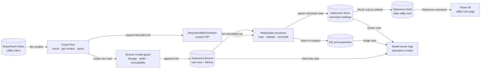

# ADR-0003: SharePoint Utility Batch-File Demo

- **Status:** Demo-only; not accepted as the production telemetry architecture
- **Date:** 2026-09-03
- **Decision owner:** Project delivery team; Product Owner and architecture approval required for production
- **Related requirements:** FR-0.2, FR-0.4, FR-0.5, FR-1.1–FR-1.5, FR-2.1, FR-2.3–FR-2.5, FR-5.3, NFR-4, NFR-6–NFR-8
- **Supersedes:** Nothing; this ADR is a bounded example under ADR-0002

## Context

The delivery team needs a tangible example of this proposed path: raw files are placed in SharePoint Online, a cloud process checks and parses them, every unique source row lands in Dataverse Bronze, configured mapping and validation promote the data to Silver, daily electricity/water cost is served from Gold, and users inspect results through a Model-driven App and Power BI.

ADR-0002 does not select SharePoint Online as the main telemetry store and does not permit synchronous Dataverse plug-ins to become a bulk transformation engine. Source interfaces, production volume, Dataverse environment/capacity, licensing, network path, hosting and tariff rules remain unresolved.

## Demo decision

1. Use SharePoint Online only as a mock, human-managed batch-file handoff. The file stays the source artifact in SharePoint; Dataverse Bronze stores immutable source-shaped rows plus file identity, hash, row number, mapping version and raw payload.
2. Let the Cloud Flow validate metadata, retrieve content, select the approved mapping and append bounded raw rows. The committed blueprint is descriptive and cannot be imported or deployed.
3. Calculate a deterministic source-record hash before insert. A repeated source record becomes a DQ observation rather than another Bronze row. A repeated file hash is not reprocessed.
4. Keep the Bronze Create plug-in small: require lineage fields, enforce permitted writers and block Update/Delete. It must not normalize all file rows.
5. Expose a bounded `RequestUtilityPromotion` Custom API that validates the run and mapping version and creates a processing request. A replayable background processor performs Bronze → Silver → Gold. The local simulator implements the observable API result but is not the selected production runtime.
6. Make source-to-target fields, meter relationships, units, intervals, ranges and tariff references configuration-driven.
7. Calculate mock cost as `accepted interval consumption × matching tariff rate`. `SUSPECT`, `REJECTED` and warm-up readings are excluded. The formula and sample rates are marked `MOCK_NOT_APPROVED` and must not be used for billing or acceptance.
8. Review ingestion runs, files, Bronze rows, Silver rows, quarantine and DQ issues in a Model-driven App. Serve accepted Gold rows to Power BI through the Dataverse connector. Power BI connection mode remains undecided.

## Demo flow

## Consequences

- The team can review real field mappings, lineage, data-quality behavior and serving grain without selecting a tenant or creating a production dependency.
- The demo deliberately exposes duplicate, invalid-unit, invalid-timestamp, meter-reset and missing-interval cases.
- SharePoint/Power Automate throughput, Dataverse capacity and API service-protection behavior are not proven by this demo.
- The local JavaScript runtime is a portable simulator only. A production background service remains .NET/C# preferred after the hosting and network gate.
- No Power Platform solution metadata is hand-authored. Tables, app, flows and plug-in registration must be created/synchronized with supported maker/PAC tooling after environment and Publisher confirmation.

## Production confirmation required

- Whether a real human-managed batch source justifies SharePoint in the production path.
- Approved parser/worker host, authentication boundary, on-premises gateway/network path and ownership.
- Maximum file size, file frequency, row count and retention; Dataverse File-column use versus protected SharePoint reference.
- Tariff source, taxes, time-of-use rules, effective dating, cost allocation, rounding and business owner.
- Exact duplicate key, meter reset/correction treatment, suspect-data treatment and reconciliation tolerance.
- Dataverse environment, Publisher prefix, capacity, region, RPO/RTO, retention and security roles.
- Power BI Import versus DirectQuery, refresh cadence and the unresolved manual-refresh acceptance statement.

## Microsoft guidance used

- [Dataverse plug-in business-logic best practices](https://learn.microsoft.com/en-us/power-apps/developer/data-platform/best-practices/business-logic/)
- [Create and use Dataverse Custom APIs](https://learn.microsoft.com/en-us/power-apps/developer/data-platform/custom-api)
- [Dataverse service-protection API limits](https://learn.microsoft.com/en-us/power-apps/developer/data-platform/api-limits)
- [Define data for a Model-driven App](https://learn.microsoft.com/en-us/power-apps/maker/model-driven-apps/define-data-model-driven-app)
- [Create a Power BI report with the Dataverse connector](https://learn.microsoft.com/en-us/power-apps/maker/data-platform/data-platform-powerbi-connector)
