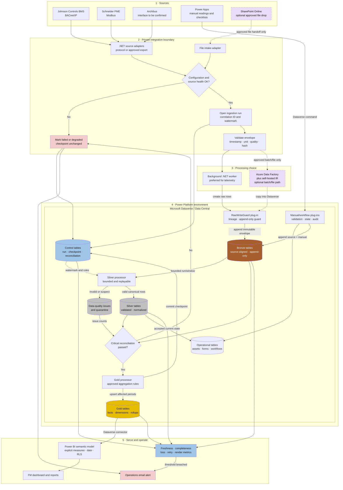

# RMIT FM Data & Automation Platform — Technical Architecture

**Document Type**: Solution Architecture
**Version**: 0.2
**Status**: Dev design draft
**Related**: [Overview](rmit-fm-overview.md), [Implementation](rmit-fm-implementation.md), [Schema Catalog](rmit-fm-medallion-schema.md), [ADR-0002](../adr/ADR-0002-ingestion-landing-and-processing-boundaries.md)

## 1. Architecture Principles

1. Keep one canonical operational model and explicit data contracts.
2. Preserve raw source values; transform only in later layers.
3. Make every job idempotent, observable, restartable, and replayable.
4. Keep OT networks private and isolate protocol-specific code behind adapters.
5. Prefer configuration over code for checklists, validation, workflows, and KPI targets.
6. Do not introduce Fabric/OneLake in this phase; use Dataverse and Power Platform capabilities first.

## 2. Logical Architecture

```mermaid
flowchart LR
    BMS[Johnson Controls BMS]
    PME[Schneider PME]
    ARC[Archibus CMMS]
    MAN[Technician forms]
    ADP[Protocol adapters\nBACnet/IP · Modbus · exports]
    ING[Ingestion service\n.NET/C# preferred]
    DC[(Operational Data Central\nDataverse contract)]
    BR[(Dataverse Bronze\nimmutable raw tables)]
    SI[(Dataverse Silver\nvalidated tables)]
    GO[(Dataverse Gold\naggregate tables)]
    WF[Workflow and email\nPower Automate or equivalent]
    BI[Power BI semantic model\n+ FM Portal]
    USERS((FM users))

    BMS -->|poll/read| ADP
    PME -->|poll/read| ADP
    ARC -->|approved export/API| ADP
    MAN -->|validated form| DC
    MAN -->|append manual envelope| BR
    ADP -->|source contract| ING
    ING -->|append raw + run metadata| BR
    BR -->|quality rules| SI
    SI -->|publish accepted current state| DC
    SI -->|business aggregates| GO
    GO -->|Dataverse connector| BI
    DC --> WF
    WF -->|email| USERS
    BI --> USERS

    classDef external fill:#d9d9d9,color:#111
    classDef process fill:#b7e1cd,color:#111
    classDef data fill:#f9cb9c,color:#111
    classDef ui fill:#9fc5e8,color:#111
    class BMS,PME,ARC external
    class ADP,ING,WF process
    class DC,BR,SI,GO data
    class MAN,BI,USERS ui
```



Bronze is the first durable telemetry landing boundary. Dataverse is already a Microsoft cloud service, so SharePoint Online is not required between the integration service and Bronze. No Fabric/OneLake dependency exists in this phase.

### 2.1 Detailed ingestion and processing flow



The solid path is the recommended phase-one baseline. The two dashed components are candidates, not selected production dependencies:

- SharePoint Online may receive approved, human-managed batch files, but it is not the telemetry raw store or system of record. The immutable logical raw layer remains Dataverse Bronze.
- Azure Data Factory (ADF) with a self-hosted integration runtime may orchestrate an approved batch/file integration and copy into Dataverse. It does not remove the need for a vendor-supported BACnet/IP or Modbus adapter. Selecting ADF introduces an Azure, licensing, network, firewall, service-account, monitoring, and support decision that must pass the Architecture Decision Gate.
- The preferred telemetry path is an approved .NET/C# adapter/worker writing the common envelope directly to Dataverse Bronze over a private outbound path.

### 2.2 Ingestion run and failure sequence

```mermaid
sequenceDiagram
    autonumber
    participant SRC as Source system
    participant ING as Adapter / .NET worker
    participant CTL as Dataverse control tables
    participant BR as Dataverse Bronze
    participant XFM as Background transformer
    participant DQ as DQ / quarantine
    participant SI as Dataverse Silver
    participant GO as Dataverse Gold
    participant OPS as Monitoring / email

    ING->>CTL: Create RUNNING ingestion run and read checkpoint
    ING->>SRC: Check configuration, connectivity and source status
    alt Source unavailable or contract invalid
        ING->>CTL: Mark FAILED or DEGRADED; keep checkpoint
        ING->>OPS: Record failure and email when alert rule is met
    else Source healthy
        ING->>SRC: Read bounded watermark window
        SRC-->>ING: Return records and source metadata
        ING->>ING: Validate envelope, calculate hash and check idempotency
        alt Malformed or unsafe record
            ING->>DQ: Preserve safe failure evidence
            ING->>CTL: Increment rejected count
        else Previously landed idempotency key
            ING->>CTL: Increment duplicate count
        else Accepted record
            ING->>BR: Append immutable raw row
        end
        XFM->>BR: Read one committed run/window
        XFM->>XFM: Map, type, normalize, detect source duplicates and run quality rules
        XFM->>DQ: Write rejected or suspect issues
        XFM->>SI: Upsert canonical rows
        XFM->>CTL: Reconcile counts and critical totals
        alt Critical reconciliation failed
            XFM->>CTL: Mark FAILED; keep checkpoint
            XFM->>OPS: Trigger investigation alert
        else Reconciliation passed
            XFM->>GO: Upsert approved hourly/daily/monthly periods
            XFM->>CTL: Commit checkpoint and mark SUCCEEDED
        end
    end
```

Each write is idempotent and restartable. A checkpoint advances only after target writes and critical reconciliation pass; a retry reuses the correlation/run evidence instead of silently skipping failed data.

### 2.3 Component responsibilities

| Component | Recommended responsibility | Explicit non-responsibility |
|---|---|---|
| `RMITFM_DataModel` solution | Own Control, Operational, Bronze, Silver, Gold and DQ table definitions | Does not run transformations |
| .NET source adapter/worker | Source health check, bounded reads, envelope/hash, Bronze append, retries and run telemetry | Does not invent register maps, units or KPI formulas |
| `RawWriteGuard` plug-in | Require lineage fields; block Bronze update/delete outside an approved correction path | Does not perform Bronze → Silver batch transformation |
| `ManualReadingValidator` plug-in | Validate active/authorized asset, force `source = manual`, and preserve actor/time/correlation | Does not implement offline synchronization |
| `WorkflowStateGuard` / `AuditEventAppender` plug-ins | Enforce allowed state transitions and append immutable audit events | Does not own approval routes configured by Product Owner |
| Background Silver processor | Schema/type checks, mapping, unit normalization, deduplication, range/gap/outlier rules, and quarantine | Does not silently discard invalid records |
| Background Gold processor | Recompute affected hourly/daily/monthly facts and approved KPI snapshots after reconciliation | Does not infer KPI formulas, baselines or targets |
| Power Automate | Low-volume approvals, reminders, email notifications and operational orchestration | Not the default high-frequency telemetry transformation engine |
| Power BI | Dataverse semantic model, explicit measures, RLS, dashboard/report consumption | Does not replace Bronze/Silver/Gold data-quality processing |

Dataverse plug-ins do not create the three data layers. `RMITFM_DataModel` creates the tables through solution-aware ALM; background processors populate them. Plug-ins remain small, stateless guards on transactional writes so they do not add avoidable latency to every row.

## 3. Modules

### 3.1 Source Adapter Module

One adapter per confirmed source/protocol. It owns connection details, polling, protocol decoding, source timestamps, and source error handling. It does not calculate business KPIs.

### 3.2 Ingestion Control Module

Creates an `ingestion_run`, validates the source contract, computes a deterministic `record_hash`, appends the Bronze record, and records accepted/rejected counts, watermark, retries, and latency. Accepted current-state operational rows are published from validated Silver data where required.

### 3.3 Data Central Module

Canonical operational entities and workflow state. It is the write boundary for forms and default ingestion. Dataverse is the selected Data Central for this phase; tenant, licensing, capacity and gateway approval remain required for production.

### 3.4 Medallion Module (Dataverse tables)

- **Bronze**: immutable source-shaped Dataverse records plus envelope metadata.
- **Silver**: typed, unit-normalized, deduplicated records with quality state and issue references.
- **Gold**: Dataverse consumption rollups, PQM summaries, targets/baselines, and KPI facts/dimensions for reporting.

### 3.5 Workflow and Capture Module

Reusable request/approval state machine for CIWG, risks, and projects; checklist templates/submissions; manual readings with QR and typed ID fallback. Notifications are email only.

### 3.6 Serving Module

Power BI semantic model uses the Dataverse connector over Gold plus operational status from Data Central. Apply campus/building/asset/date filters and row-level security in the model/data layer.

## 4. Ingestion Contract

Every adapter emits a common envelope:

| Field | Rule |
|---|---|
| `source_system` | Controlled value: `BMS`, `PME`, `ARCHIBUS`, `MANUAL` |
| `source_record_key` | Stable source key; otherwise deterministic composite |
| `source_timestamp` | Original timestamp with timezone/offset evidence |
| `asset_key` / `meter_key` | Canonical key after mapping; unresolved values are rejected/quarantined |
| `metric_code` | `WATER_KWH`, `POWER_KWH`, `DEMAND_KW`, `VOLTAGE`, `THD`, or approved code |
| `value` / `unit` | Decimal value and source unit; no silent conversion |
| `quality_code` | Source quality/status where available |
| `ingestion_run_id` | Foreign key to control metadata |
| `record_hash` | SHA-256 of normalized source identity + timestamp + metric + value + unit |
| `raw_payload` | Original payload/file fragment or protected payload reference, immutable |

Upsert key: `(source_system, source_record_key, source_timestamp, metric_code)` where the source key is reliable; otherwise use `(source_system, meter_key, source_timestamp, metric_code, record_hash)`. Updates to an existing source record create a correction event and do not erase the original Bronze row.

## 5. Security and Operations

- Entra ID/SSO and least-privilege role groups where approved.
- Service accounts/connections are environment-specific; secrets never enter source control.
- OT protocol traffic stays on private network paths; use a gateway or integration host.
- Dev, Test, and Prod are isolated; solutions, environment variables, and connection references support ALM.
- Metrics: source-to-landing latency, landing-to-Gold latency, freshness, accepted/rejected count, duplicate count, gap count, retry count, and estimated loss rate.

## 6. Architecture Decisions Required Before Production

1. Dataverse environment, licensing/capacity and gateway topology.
2. Data residency, retention, recovery and audit.
3. Exact one-minute/five-minute freshness acceptance test.
4. BMS/PME register/object maps and Archibus export/interface.
5. RPO/RTO, volume, polling cadence, and KPI ownership.
6. Whether any approved batch/file source justifies SharePoint Online intake or ADF with self-hosted integration runtime; neither is a default telemetry dependency.

## 7. Microsoft Implementation References

- [Create and configure a self-hosted integration runtime](https://learn.microsoft.com/en-us/azure/data-factory/create-self-hosted-integration-runtime?tabs=data-factory)
- [Copy data from and to Dynamics 365 and Microsoft Dataverse](https://learn.microsoft.com/en-us/azure/data-factory/connector-dynamics-crm-office-365?tabs=data-factory)
- [Dataverse plug-in business-logic best practices](https://learn.microsoft.com/en-us/power-apps/developer/data-platform/best-practices/business-logic/)
- [Optimize performance for bulk create and update operations](https://learn.microsoft.com/en-us/power-apps/developer/data-platform/optimize-performance-create-update)
- [SharePoint Online limits](https://learn.microsoft.com/en-us/office365/servicedescriptions/sharepoint-online-service-description/sharepoint-online-limits)
