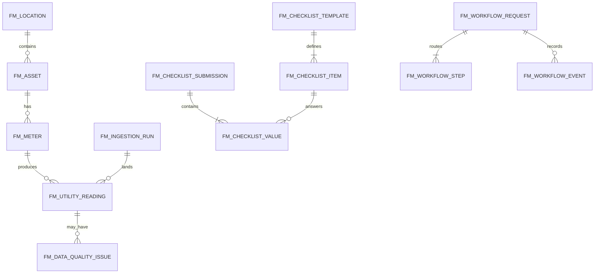

# RMIT FM — Medallion and Operational Schema Catalog

**Version**: 0.1
**Status**: Dev logical design for Dataverse tables; physical publisher prefix, column types and capacity settings require environment confirmation.

## 1. Naming and Common Columns

Use publisher-prefixed logical names in Dataverse (display names may use `FM Bronze`, `FM Silver`, `FM Gold` prefixes). Every table has a surrogate UUID/key where needed and these lineage columns:

`source_system`, `source_record_key`, `ingestion_run_id`, `source_timestamp`, `ingested_at_utc`, `record_hash`, `created_at_utc`, `updated_at_utc`.

All event times are stored in UTC with the original offset retained when supplied. Decimal precision and units are explicit. No hard delete is allowed in Bronze.

## 2. Operational Data Central Tables

| Table | Grain / purpose | Required key columns |
|---|---|---|
| `fm_location` | One campus/building/area | `location_id`, `location_type`, `parent_location_id`, `code`, `name`, `is_active` |
| `fm_asset` | One maintainable asset/equipment | `asset_id`, `asset_code`, `location_id`, `asset_type`, `qr_code`, `is_active` |
| `fm_meter` | One water/power/PQM meter or feeder | `meter_id`, `meter_code`, `asset_id`, `metric_code`, `protocol`, `source_system`, `unit`, `is_active` |
| `fm_source_system` | One source/adapter configuration | `source_system_id`, `code`, `vendor`, `connection_ref`, `timezone`, `enabled` |
| `fm_utility_reading` | One accepted operational reading | `reading_id`, `meter_id`, `metric_code`, `source_timestamp`, `value_decimal`, `unit`, `quality_code`, `source` |
| `fm_ingestion_run` | One adapter execution/batch | `ingestion_run_id`, `source_system`, `started_at_utc`, `ended_at_utc`, `watermark_from`, `watermark_to`, `status`, counts |
| `fm_data_quality_issue` | One rejected/suspect record issue | `issue_id`, `layer`, `rule_code`, `record_hash`, `severity`, `status`, `details` |
| `fm_checklist_template` | One configurable checklist definition | `template_id`, `asset_type`, `location_id`, `version`, `status` |
| `fm_checklist_item` | One field/rule in a template | `item_id`, `template_id`, `sequence`, `code`, `unit`, min/max, `required` |
| `fm_checklist_submission` | One submitted checklist | `submission_id`, `template_id`, `asset_id`, `submitted_by`, `submitted_at_utc`, `status` |
| `fm_checklist_value` | One answer/value in a submission | `value_id`, `submission_id`, `item_id`, `value_decimal/text`, `is_out_of_range` |
| `fm_workflow_request` | One CIWG/risk/project request | `request_id`, `workflow_type`, `business_key`, `status`, `owner_id`, `due_at_utc` |
| `fm_workflow_step` | One approval step instance | `step_id`, `request_id`, `sequence`, `approver_role/user`, `status`, `due_at_utc` |
| `fm_workflow_event` | Immutable status/action event | `event_id`, `request_id`, `step_id`, `event_type`, `actor_id`, `event_at_utc`, `comments` |

`fm_utility_reading` is the canonical operational table. It retains the latest accepted state and links to the immutable Bronze record through `ingestion_run_id` and `record_hash`.

## 3. Bronze Tables — Raw After Ingestion

Bronze is source-shaped and append-only Dataverse tables. Power Automate or the approved integration service writes the raw envelope directly; no Link to Microsoft Fabric is used.

| Table | Grain | Key / index | Data rules |
|---|---|---|---|
| `bronze.utility_reading_raw` | One source reading/metric | Alternate key `record_hash`; views/indexes by source/time | Preserve raw payload, source unit/value/timestamp, source key, adapter version |
| `bronze.checklist_submission_raw` | One form submission | Alternate key `record_hash`; views by submitted date | Preserve submitted values and actor metadata |
| `bronze.archibus_extract_raw` | One source row/file record | file/batch + row hash | Keep original file name, row number, extract timestamp |
| `bronze.ingestion_run_raw` | One adapter run | `ingestion_run_id` | Append status, watermarks, counts, errors |

Minimum `bronze.utility_reading_raw` columns: `record_hash`, `source_system`, `source_record_key`, `meter_code`, `metric_code`, `source_timestamp`, `source_timezone`, `source_value_decimal`, `source_unit`, `source_quality_code`, `raw_payload`, `ingestion_run_id`, `adapter_version`, `ingested_at_utc`.

## 4. Silver Tables — Cleansed and Validated

| Table | Grain | Key / checks |
|---|---|---|
| `silver.dim_location` | One canonical location | `location_key`; hierarchy and active-date checks |
| `silver.dim_asset` | One canonical asset | `asset_key`; QR and fallback code uniqueness |
| `silver.dim_meter` | One canonical meter | `meter_key`; source mapping, metric/unit compatibility |
| `silver.utility_reading` | One normalized reading | `(meter_key, metric_code, source_timestamp, record_hash)`; dedup, unit, range, gap, outlier checks |
| `silver.checklist_result` | One normalized answer | `(submission_id, item_id)`; required/range/unit checks |
| `silver.workflow_event` | One immutable workflow event | `event_id`; actor/time/status transition checks |
| `silver.data_quality_issue` | One issue per rule/record | `(record_hash, rule_code)`; severity and resolution status |

Silver `utility_reading` columns include: `reading_key`, `meter_key`, `metric_code`, `event_at_utc`, `value_decimal`, `normalized_unit`, `quality_state` (`VALID`, `SUSPECT`, `REJECTED`), `is_duplicate`, `is_gap`, `is_outlier`, `source`, `record_hash`, `ingestion_run_id`.

Rejected records remain queryable in Silver issue/quarantine tables and are never silently promoted to Gold.

## 5. Gold Tables — Reporting and KPI Serving

| Table | Grain | Main measures |
|---|---|---|
| `gold.utility_hourly` | meter × metric × hour | consumption, demand, reading_count, valid_count, missing_count, baseline, target, variance_pct |
| `gold.utility_daily` | meter × metric × day | daily total/average/min/max, completeness_pct, baseline/target variance |
| `gold.utility_monthly` | meter × metric × month | monthly total, trend, baseline/target variance |
| `gold.power_quality_hourly` | feeder/meter × hour | voltage statistics, THD statistics, threshold_breach_count |
| `gold.checklist_trend` | asset/item × period | value statistics, out_of_range_count, completion_pct |
| `gold.fm_kpi_snapshot` | KPI × org scope × period | KPI value, numerator, denominator, target, status, as_of_utc |
| `gold.workflow_sla` | request/step | cycle time, overdue flag, escalation count, completion status |

Gold tables must carry `as_of_utc`, `data_freshness_minutes`, and `source_row_count` so a dashboard can distinguish a valid zero from stale or incomplete data.

## 6. Relationships

## 7. Promotion Rules

1. Bronze accepts only schema-valid envelopes; malformed input is rejected with a run-level error and preserved as a failed-ingestion artifact where safe.
2. Silver promotes only records with resolved meter/asset mapping and explicit quality state.
3. Gold uses `quality_state = VALID` by default; `SUSPECT` handling requires a documented KPI rule.
4. Every promotion is rerunnable for a bounded watermark window.
5. Counts and critical sums reconcile between layers; differences create `fm_data_quality_issue` and block release when severity is critical.
