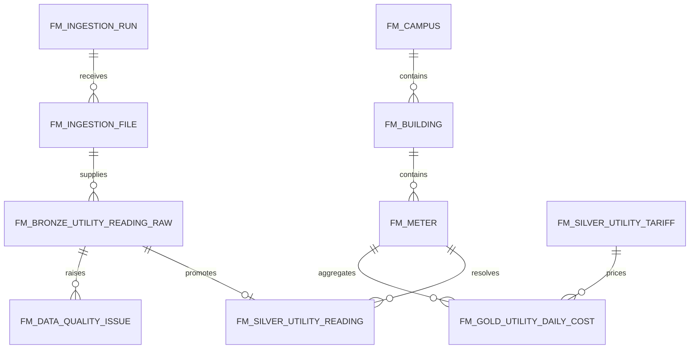

# SPO → Dataverse Utility Cost Demo

**Status:** Runnable local proof of concept plus non-deployable Power Platform blueprints  
**Scenario:** Multiple electricity and water files for Saigon South Campus  
**Safety:** Synthetic data only; no SharePoint, Dataverse, Power Automate or Power BI environment connection

## Outcome

The demo makes the proposed review conversation concrete:

- six files use four mappings and three source shapes;
- 21 parsed rows produce 19 unique immutable Bronze rows and two duplicate observations;
- invalid raw values remain visible in Bronze;
- 14 readings resolve to canonical Meter → Building → Campus relationships in Silver;
- three invalid readings enter quarantine and two accepted readings are marked `SUSPECT` for missing intervals;
- nine valid billable intervals produce three daily Gold rows;
- illustrative result: `54 kWh`, `3.0 m3`, and `169,200 VND` based on explicitly mock tariffs.

The total is not a business-approved KPI, invoice or cost formula.

## Run it

```bash
cd repositories/rmit-fm-integrations/demo/utility-cost-pipeline
npm test
npm start
```

Open `http://127.0.0.1:4173`. The demo exposes:

- `GET /api/health` — proves local/mock mode and confirms no Dataverse writes;
- `GET /api/demo` — reads the mock SharePoint inbox and returns all logical layers;
- `POST /api/replay` — reruns the deterministic validation and aggregation path.

No package install is required; the simulator uses Node.js built-in modules only.

## Source files and intentional exceptions

| File | Shape | Purpose |
|---|---|---|
| `PME_ELECTRICITY_2026-08-01_PART01.csv` | PME cumulative kWh | Normal hourly readings |
| `PME_ELECTRICITY_2026-08-01_PART02.csv` | PME cumulative kWh | Duplicate, invalid `kW` unit, missing interval and invalid timestamp |
| `BMS_WATER_2026-08-01_PART01.csv` | BMS cumulative m3 | Normal hourly readings |
| `BMS_WATER_2026-08-01_PART02.csv` | BMS cumulative m3 | Duplicate, decreasing counter and missing interval |
| `MANUAL_WATER_2026-08.csv` | Manual cumulative m3 | Manual reading tagged `source = manual` and a 24-hour interval |
| `UTILITY_TARIFF_2026-08.json` | Effective-dated references | Synthetic rates marked `MOCK_NOT_APPROVED` |

Files live in `rmit-fm-integrations/demo/utility-cost-pipeline/mock-data/sharepoint-inbox`. They contain no production telemetry or real user identity.

## Source-to-target and relationships

The executable mapping is `config/mappings.json`. Each file-name pattern selects its own source fields, but every utility reading lands in the same canonical contract.

| Canonical field | PME raw | BMS raw | Manual raw | Silver use |
|---|---|---|---|---|
| `sourceTimestamp` | `Timestamp` | `sample_time` | `reading_time` | UTC event, original offset and local date |
| `meterCode` | `Meter` | `point_name` | `asset_id` | Lookup to `fm_meter` |
| `sourceValue` | `Reading` | `total_value` | `reading_value` | Cumulative value and interval delta |
| `sourceUnit` | `Unit` | `uom` | `reading_unit` | Exact canonical-unit validation |
| `sourceQuality` | `Quality` | `status` | `quality` | Source-quality validation |
| `submittedBy` | — | — | `operator` | Manual-capture audit context |



## Validation and promotion behavior

1. File gate checks extension, byte size, duplicate file hash, file-name mapping, parseability and required headers.
2. Bronze stores raw strings, source payload, file/row lineage, mapping version, run ID, ingestion time and deterministic record hash. No invalid source value is silently corrected.
3. The duplicate hash is based on source system, meter, metric, timestamp, value and unit. A repeated hash creates `DUPLICATE_SOURCE_RECORD`; it is not appended again.
4. Silver resolves active meter, building and campus records; parses timestamp/value; validates source quality and exact unit; then detects negative cumulative deltas, gaps and configured outliers.
5. `REJECTED` records remain in quarantine. `SUSPECT` records remain queryable in Silver but are excluded from Gold by default.
6. Gold accepts only `VALID`, non-warm-up intervals with a matching effective-dated tariff. It carries the source-row count, tariff status, formula status and `asOfUtc`.

## Power Platform review artifacts

- `utility-cost-dataverse-blueprint.json` describes Tables, Columns, alternate keys and Relationships for review.
- `spo-utility-cost-cloud-flow.blueprint.json` describes the Cloud Flow scopes, retries and error path.
- `utility-cost-model-driven-app.blueprint.json` describes navigation, forms and public views.

These are blueprints, not PAC/solution import files. Creating the real artifacts requires the approved Dev environment, Publisher, connection references, environment variables, DLP/security review and solution-aware ALM.

## Demo walkthrough

1. Open Pipeline overview and point out the five-stage lineage spine.
2. Open File intake and compare the two source CSV shapes.
3. Open Bronze raw; find `kW` and `not-a-timestamp` to prove raw preservation.
4. Open Field mappings; show that selected fields and target tables are config, not hard-coded per UI.
5. Open Silver mapped; show resolved `AB2`/`D1` and `SGS` relationships plus `manual` source.
6. Open DQ queue; review duplicate, unit, timestamp, negative-delta and missing-interval rules.
7. Open Gold cost; show that suspect/rejected/warm-up rows are excluded and every row says `MOCK_NOT_APPROVED`.
8. Replay the pipeline and show stable counts and no external writes.

## Requirement traceability

| Requirement | Demo artifact/evidence | Status |
|---|---|---|
| FR-0.2 | Dataverse blueprint, mappings and relationships | Demonstrated logically; physical schema gated |
| FR-0.4 | Mock PME/BMS/manual file contracts | Mock only; vendor-supported interfaces unresolved |
| FR-0.5 | Dataverse Bronze logical landing | Summary override applied: no Fabric/OneLake |
| FR-1.1–FR-1.4 | Water raw, validation and daily aggregation | Local demo; hourly/monthly Gold not included |
| FR-1.5, FR-1.7 | Dashboard surface and campus/building/meter serving columns | Local UI only; Power BI artifact gated |
| FR-2.1, FR-2.3 | Electricity raw, duplicate/unit/gap validation and aggregation | Local demo |
| FR-2.4 | Effective-dated Gold shape | Retention not selected |
| FR-2.5, FR-2.6 | Electricity cost/consumption serving shape | Local UI only |
| FR-5.3 | Manual water file tagged `source = manual` | Demonstrated with synthetic record |
| NFR-4 | Raw preservation, lineage, DQ/quarantine and reconciliation | Automated local tests |
| NFR-6–NFR-8 | Configuration, bounded replay and documentation | Demonstrated locally; production evidence pending |

## Assumptions and risks

- This is a small, controlled batch demo. It does not prove Dataverse throughput, service-protection handling, licensing, capacity or the provisional freshness target.
- CSV parsing inside a production Cloud Flow is not selected. Quoted/multiline/vendor-specific files should be handled by an approved robust parser, preferably in the .NET integration boundary.
- The example file hash and natural key require Product Owner/data-owner confirmation for corrections, meter resets and late-arriving replacements.
- SharePoint is not the telemetry system of record. The production default remains the direct adapter/worker → Dataverse Bronze path in ADR-0002 unless a real batch-file handoff is approved.
- Current branding in the local UI is an accessible demo palette, not RMIT-approved brand evidence.
- Power BI Import versus DirectQuery and refresh cadence remain open architecture decisions.
