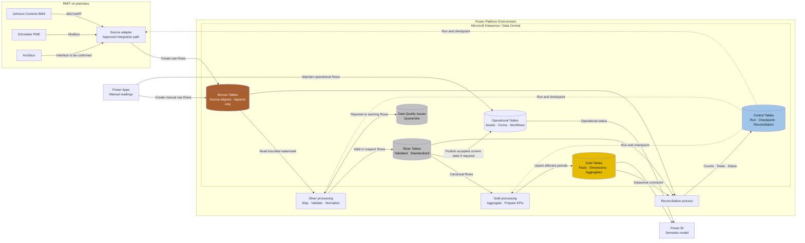
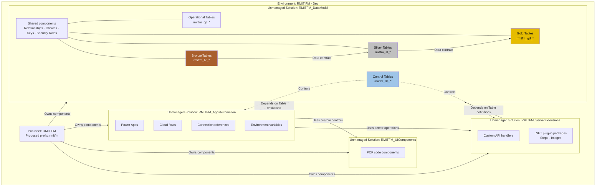
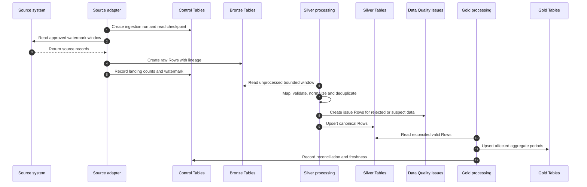

# Kiến trúc Dataverse Medallion cho Data Engineering

**Document type**: Logical data architecture  
**Status**: Dev design draft  
**Scope**: Dataverse Data Central, Bronze/Silver/Gold, Power Platform Solution và data processing  
**Related requirements**: `FR-0.1`, `FR-0.2`, `FR-1.1`–`FR-1.4`, `FR-2.1`–`FR-2.4`, `NFR-4`, `NFR-6`–`NFR-8`

Tài liệu này làm rõ cách triển khai Medallion Architecture trong Microsoft Dataverse. Fabric/OneLake không thuộc phase hiện tại. Các Table, Column, Key và aggregation rule chỉ được chốt sau khi hoàn thành Data Profiling và Source-to-Target Mapping cho BMS, PME, Archibus và historical data.

## 1. Quyết định thiết kế

1. Tách `Dev`, `Test` và `Prod` bằng Power Platform **Environments**; không tạo một Environment riêng cho từng Bronze/Silver/Gold layer.
2. Xem **Dataverse/Data Central** là data boundary chứa operational data, control data và ba logical data layers.
3. Tách Bronze, Silver và Gold bằng Dataverse **Tables**, naming convention, data contract, Security Roles và processing boundary.
4. Dùng một **Solution** sở hữu toàn bộ Table definitions để tránh một Table xuất hiện trong nhiều Solutions và tạo dependency conflict.
5. Có thể dùng Solution riêng cho processing components, nhưng Solution này không sở hữu lại các Tables của data model.
6. Bronze là append-only; Silver là canonical và chuẩn hóa; Gold là reporting-ready star schema và aggregate.
7. Không chốt extraction interface, KPI formula, retention hoặc production capacity khi chưa có phê duyệt của RMIT.

Theo Power Platform terminology, **Solution** là package chứa solution components như Tables, Columns, Relationships, Choices, Cloud flows, Connection references và Security Roles. Solution không phải database và không đóng gói các business data Rows khi deploy.

## 2. Kiến trúc logical

`Source adapter` không được expose BACnet/IP hoặc Modbus ra public internet. Vị trí host, gateway topology và network path phải qua Architecture Decision Gate trước production.

## 3. Power Platform Solution layout

`rmitfm` chỉ là proposed Publisher prefix. Phải xác nhận Publisher trong target Dataverse Environment trước khi tạo Tables vì logical names không đổi được dễ dàng sau khi component đã được tạo.

### 3.1 ALM flow

| Stage | Solution type | Quy tắc |
|---|---|---|
| Dev | Unmanaged Solution | Tạo và chỉnh sửa solution components; lưu unpacked solution vào source control |
| Test | Managed Solution | Import `RMITFM_DataModel`, sau đó `RMITFM_ServerExtensions`/`RMITFM_UIComponents`, cuối cùng `RMITFM_AppsAutomation`; không chỉnh trực tiếp managed components |
| Prod | Managed Solution | Deploy qua approved pipeline và change control; không chứa credentials hoặc environment-specific secret values |

Reference/configuration data và historical/business data phải có migration process riêng. Import Solution không migrate các Dataverse Rows này.

Source code được tách theo deployable boundary: Power Platform metadata, Dataverse .NET plug-ins, PCF TypeScript components, external .NET integrations và Power BI PBIP. Xem [ADR-0001](../adr/ADR-0001-repository-and-solution-segmentation.md). Compiled plug-in/PCF artifacts được build trong pipeline và không phải source of truth trong Git.

## 4. Data design gate trước khi tạo Tables

Data Engineer phải hoàn thành các bước sau cho từng source entity hoặc record type:

1. Thu thập sanitized sample data và source documentation.
2. Xác định **grain**: một source Row đại diện cho sự kiện hoặc measurement nào.
3. Xác định natural key, source record ID và correction behavior.
4. Profile null, duplicate, invalid format, out-of-order và late-arriving Rows.
5. Xác định timestamp owner, timezone, daylight-saving behavior và clock drift.
6. Xác định metric, source unit, scaling và standard unit.
7. Phân biệt cumulative reading với interval consumption.
8. Xác định volume, polling cadence, history depth và retention requirement.
9. Lập Source-to-Target Mapping từ source đến Bronze, Silver và Gold.
10. Chốt Data Quality Rules, reconciliation checks và Gold aggregation formulas với owner.

Không suy luận aggregation từ tên chart. Ví dụ, cumulative meter reading có thể cần tính delta, interval consumption có thể cộng, demand có thể dùng maximum hoặc average, còn THD không được cộng. Công thức cuối cùng cần Product Owner phê duyệt.

## 5. Control Tables

Control Tables là pipeline control plane, không phải data layer thứ tư.

| Proposed logical name | Grain | Mục đích |
|---|---|---|
| `rmitfm_de_ingestionrun` | Một adapter execution hoặc batch | Watermark, status, accepted/rejected/duplicate counts, retry và latency |
| `rmitfm_de_pipelinecheckpoint` | Một source × pipeline | Checkpoint cuối đã commit và replay window |
| `rmitfm_de_reconciliationresult` | Một layer boundary × run | Source/target counts, critical totals, variance và pass/fail |
| `rmitfm_de_dataqualityrule` | Một versioned rule | Rule code, scope, severity, parameters và effective dates |
| `rmitfm_de_sourceconfiguration` | Một source configuration | Source timezone, enabled flag và non-secret processing parameters |

Secrets, passwords, tokens, certificates, tenant IDs và private endpoints không được lưu trong các Rows này hoặc trong source control.

## 6. Bronze data module

Bronze giữ source data gần nguyên bản nhất, cộng ingestion envelope để trace và replay.

### 6.1 Table boundary

Mặc định tạo một Bronze Table cho mỗi source entity/record contract khác nhau. Chỉ hợp nhất BMS và PME vào cùng một utility Table khi Data Profiling xác nhận chúng có cùng grain và có thể biểu diễn bằng một common envelope mà không làm mất source semantics.

| Proposed Table | Grain | Trạng thái |
|---|---|---|
| `rmitfm_br_utilityreadingraw` | Một source reading × metric | Candidate common Table cho BMS/PME; phải xác nhận sau profiling |
| `rmitfm_br_manualreadingraw` | Một manual meter reading | Dùng `source = MANUAL`, giữ actor và submission evidence |
| `rmitfm_br_checklistsubmissionraw` | Một checklist submission | Giữ template version và submitted values |
| `rmitfm_br_archibusextractraw` | Một source row trong một extract | Chưa chốt cho đến khi RMIT xác nhận Archibus interface/export |

Nếu BMS và PME có grain hoặc payload quá khác nhau, thay candidate common Table bằng `rmitfm_br_bmsreadingraw` và `rmitfm_br_pmereadingraw`.

### 6.2 Minimum Columns cho utility raw data

| Column | Ý nghĩa |
|---|---|
| `source_system` | Controlled source code như `BMS`, `PME`, `MANUAL` |
| `source_record_key` | Stable source identifier nếu source cung cấp |
| `source_meter_id` | Meter/device identifier đúng như source |
| `source_metric_code` | Metric/object/register identifier đúng như source |
| `source_timestamp` | Original event timestamp |
| `source_timezone` | Original timezone hoặc offset evidence |
| `source_value` | Source value chưa normalize |
| `source_unit` | Source unit chưa normalize |
| `source_quality_code` | Source quality/status nếu có |
| `raw_payload` | Protected original payload hoặc approved payload reference |
| `ingestion_run_id` | Link đến ingestion run |
| `record_hash` | Deterministic deduplication/lineage value |
| `adapter_version` | Version của adapter/data contract |
| `ingested_at_utc` | Dataverse landing time |

Bronze không normalize unit, không aggregate, không ghi đè source value và không hard delete. Nếu dùng Dataverse Web API, không dùng unrestricted Upsert cho Bronze vì Upsert có thể update Row hiện hữu. Dùng Alternate Key với create-only semantics hoặc xử lý duplicate-key response để giữ append-only behavior.

## 7. Silver data module

Silver chuyển các source-specific Rows thành canonical, typed và quality-assessed data.

| Proposed Table | Grain | Vai trò |
|---|---|---|
| `rmitfm_sl_location` | Một canonical location | Campus/building/area hierarchy và active dates |
| `rmitfm_sl_asset` | Một canonical asset | Asset identity, location và active state |
| `rmitfm_sl_meter` | Một canonical meter/feeder | Asset relationship, supported metrics và standard units |
| `rmitfm_sl_metric` | Một approved metric | Data type, standard unit và aggregation behavior reference |
| `rmitfm_sl_unit` | Một approved unit | Unit code và approved conversion metadata |
| `rmitfm_sl_sourcemetermap` | Một source meter mapping | Map source identifier sang canonical meter |
| `rmitfm_sl_utilityreading` | Một meter × metric × event time | Canonical reading sau validation/normalization |
| `rmitfm_sl_dataqualityissue` | Một rule × affected record | Quarantine/warning evidence và resolution status |

`rmitfm_sl_utilityreading` tối thiểu cần `meter_id`, `metric_id`, `event_at_utc`, `normalized_value`, `standard_unit_id`, `quality_state`, `source_system`, `source_record_key`, `bronze_record_hash` và `ingestion_run_id`.

Silver thực hiện:

- schema và type validation;
- source-to-canonical mapping;
- timestamp normalization về UTC nhưng vẫn giữ source evidence;
- approved unit conversion;
- duplicate, range, missing-interval và outlier checks;
- gắn `quality_state` bằng `VALID`, `SUSPECT` hoặc `REJECTED`;
- ghi issue/quarantine thay vì silently discard record.

Silver có thể dùng normalized relationships để không lặp lại location, asset, meter, metric và unit descriptions trên từng reading Row.

## 8. Gold data module

Gold phục vụ Power BI và use cases đã được phê duyệt. Gold không cần normalized giống transaction model; nên dùng reporting-oriented Fact/Dimension Tables và pre-aggregates.

### 8.1 Dimension Tables

| Proposed Table | Grain |
|---|---|
| `rmitfm_gd_dimdate` | Một calendar date |
| `rmitfm_gd_dimlocation` | Một reporting location member hoặc version |
| `rmitfm_gd_dimasset` | Một reporting asset member hoặc version |
| `rmitfm_gd_dimmeter` | Một reporting meter/feeder member hoặc version |
| `rmitfm_gd_dimmetric` | Một reporting metric với documented unit |

### 8.2 Fact Tables

| Proposed Table | Grain |
|---|---|
| `rmitfm_gd_factutilityhourly` | Một meter × metric × hour |
| `rmitfm_gd_factutilitydaily` | Một meter × metric × day |
| `rmitfm_gd_factutilitymonthly` | Một meter × metric × month |
| `rmitfm_gd_factpowerqualityhourly` | Một feeder/meter × metric × hour |
| `rmitfm_gd_factchecklisttrend` | Một asset × checklist item × reporting period |
| `rmitfm_gd_factworkflowsla` | Một workflow request/step |
| `rmitfm_gd_factkpisnapshot` | Một KPI × organizational scope × period |

Mỗi Gold Fact cần các observability Columns phù hợp như `aggregation_run_id`, `as_of_utc`, `data_freshness_minutes`, `source_row_count`, `valid_row_count` và `completeness_percentage`. Baseline, target, numerator và denominator chỉ được thêm khi business owner xác nhận định nghĩa.

## 9. Processing sequence

Mọi processing step phải idempotent, restartable và replayable. Watermark chỉ được commit sau khi target writes và reconciliation tương ứng thành công.

## 10. Access model

| Security Role hoặc application identity | Bronze | Silver | Gold | Control |
|---|---|---|---|---|
| Ingestion application user | Create, Read; không Update/Delete | Không | Không | Create/Update run theo phạm vi |
| Data processing identity | Read | Create/Read/Update | Create/Read/Update | Read/Update checkpoint và reconciliation |
| FM Data Engineer | Read | Read/Write theo nhiệm vụ | Read/Write theo nhiệm vụ | Read/Operate |
| Power BI service identity | Không mặc định | Không mặc định | Read | Read freshness/status nếu cần |
| FM application user | Không | Không | Không hoặc Read hạn chế | Không hoặc Read hạn chế |
| Platform administrator | Administrative access | Administrative access | Administrative access | Administrative access |

Security Role definitions có thể nằm trong Solution, nhưng assignment của user/application user vào role là environment-specific deployment configuration.

## 11. Verification và acceptance evidence

Mỗi source/layer cần test và evidence cho:

- normal, boundary, duplicate, missing, stale và out-of-order data;
- invalid unit, invalid mapping, retry và source correction;
- late-arriving Rows và timezone/daylight-saving behavior;
- Bronze append-only behavior;
- Silver quality-state và quarantine behavior;
- Gold aggregate reconciliation;
- checkpoint recovery và replay;
- positive/negative access tests;
- source-to-report freshness và dashboard render time như hai measurements độc lập.

Không tuyên bố đạt data-loss SLA hoặc freshness SLA chỉ từ code inspection. Cần acceptance formula và reproducible test profile được phê duyệt.

## 12. Requirement traceability

| Requirement | Design artifact trong tài liệu | Evidence cần có |
|---|---|---|
| `FR-0.1` | Environment và solution-based ALM | Managed import logs, pipeline result, DLP/security review |
| `FR-0.2` | Bronze/Silver/Gold Table model và naming | Approved data dictionary và Source-to-Target Mapping |
| `FR-1.1`, `FR-2.1`, `FR-2.2` | Source adapter và Bronze landing | Contract/integration tests và ingestion reconciliation |
| `FR-1.2`, `FR-1.3`, `FR-2.3` | Bronze lineage và Silver quality pipeline | Dedup/range/gap/unit/outlier test results |
| `FR-1.4`, `FR-2.3`, `FR-2.4` | Gold Facts/Dimensions và aggregates | Hour/day/month reconciliation và retention evidence |
| `NFR-4` | Lineage, Data Quality Issues và reconciliation | Trace một sample Row từ source đến report |
| `NFR-6` | Source-aligned Bronze và canonical Silver | Capacity/profile tests với agreed volume |
| `NFR-7` | Configuration-driven rules và Solution ALM | Configuration change và redeployment test |
| `NFR-8` | Append-only Bronze và audit evidence | Audit and correction-path tests |

## 13. Open decisions và risks

1. Chưa có approved BMS/PME object/register maps, transport details, units/scaling và timestamp ownership.
2. Archibus interface, export method, record count và volume chưa xác nhận.
3. Chưa có final Publisher, Dataverse Environment, licensing/capacity, region và retention approval.
4. Chưa chốt gateway hoặc approved .NET/C# integration host và network path.
5. Chưa đủ sample data để quyết định gộp hay tách BMS/PME Bronze Tables.
6. Historical migration cần profiling, mapping, deduplication, cutoff/delta, dry run, reconciliation và rollback/reload procedure.
7. Dùng `<=5 phút` làm provisional freshness upper bound; yêu cầu tối đa một phút sau manual refresh vẫn là acceptance criterion chưa thống nhất.
8. Data-loss target dưới 1–2% chưa có công thức acceptance chính xác.
9. Gold KPI formulas, baselines, targets và aggregation behavior cần Product Owner phê duyệt.

## 14. Microsoft references

- [Solution concepts](https://learn.microsoft.com/power-platform/alm/solution-concepts-alm)
- [Organize your solutions](https://learn.microsoft.com/power-platform/alm/organize-solutions)
- [Dependency tracking for solution components](https://learn.microsoft.com/power-platform/alm/dependency-tracking-solution-components)
- [Define alternate keys](https://learn.microsoft.com/power-apps/developer/data-platform/define-alternate-keys-entity)
- [Use Upsert with the Dataverse Web API](https://learn.microsoft.com/power-apps/developer/data-platform/use-upsert-insert-update-record)
- [Environment variables](https://learn.microsoft.com/power-apps/maker/data-platform/environmentvariables)
