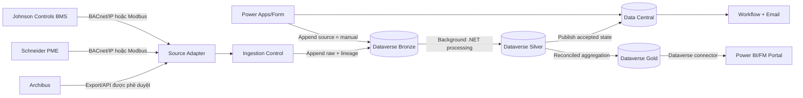

# Kiến trúc kỹ thuật

Chi tiết cách tổ chức Power Platform Environment, Solutions, Dataverse Tables và ba data layers được mô tả tại [Kiến trúc Dataverse Medallion cho Data Engineering](kien-truc-dataverse-medallion.md).

## 1. Các module

### Source Adapter Module

Mỗi source/protocol có adapter riêng. Adapter chịu trách nhiệm đọc dữ liệu, giải mã BACnet/IP hoặc Modbus, giữ source timestamp và chuyển dữ liệu về ingestion contract chuẩn.

### Ingestion Control Module

Tạo `fm_ingestion_run`, kiểm tra contract, tính `record_hash`, ghi nhận accepted/rejected count, watermark, retry và latency. Ingestion phải idempotent và restartable.

### Data Central Module

Chứa các operational entities như meter, asset, utility reading, checklist và workflow. Đây là write boundary cho form và ingestion; Dataverse là Data Central được chọn cho phase này, còn tenant, license, capacity và gateway phải được duyệt trước production.

### Medallion Module trong Dataverse

- **Bronze**: bảng Dataverse append-only, giữ raw data và payload/reference nguồn.
- **Silver**: bảng Dataverse đã chuẩn hóa, kiểm tra chất lượng và gắn `quality_state`.
- **Gold**: bảng Dataverse aggregate và KPI phục vụ Power BI.

### Workflow và Capture Module

Quản lý request/approval, checklist template/submission và manual meter reading. Manual reading dùng QR trước, typed asset ID sau; lỗi mạng chỉ trả về retryable error.

### Serving Module

Power BI semantic model đọc Gold và trạng thái operational từ Data Central. Các filter chuẩn gồm campus, building, asset/meter và date range.

## 2. Luồng dữ liệu

Bronze là durable telemetry landing đầu tiên. Dataverse đã là Microsoft cloud service nên không cần đặt SharePoint Online ở giữa integration service và Bronze. SharePoint Online chỉ là lựa chọn cho approved file handoff do con người quản lý, không phải raw telemetry store. Không dùng Fabric/OneLake trong phase này.

Sơ đồ chi tiết về source health check, retry/checkpoint, lựa chọn .NET/ADF, plug-in boundary, reconciliation và xử lý sau Gold nằm tại [Logical Architecture](../architecture/rmit-fm-architecture.md#21-detailed-ingestion-and-processing-flow). Thiết kế chi tiết các Dataverse Tables nằm tại [Kiến trúc Dataverse Medallion](kien-truc-dataverse-medallion.md).

Quy tắc chọn processor:

- Ưu tiên background .NET/C# worker cho telemetry BACnet/IP và Modbus.
- ADF + self-hosted integration runtime chỉ là lựa chọn cho batch/file path đã được phê duyệt; cần qua gate về Azure subscription, licensing, network, firewall, service account và vận hành.
- Dataverse plug-ins chỉ bảo vệ write invariant, validation và immutable audit. Plug-ins không chạy bulk Bronze → Silver → Gold.
- Power Automate phù hợp cho approval, reminder, email và low-volume operational orchestration; không phải mặc định cho high-frequency telemetry transform.

## 3. Quy tắc bảo mật

- Không expose BACnet/Modbus trực tiếp ra public internet.
- Dùng private network path, gateway hoặc integration host.
- Secrets dùng secret store/connection reference, không commit vào source code.
- Tách Dev, Test và Prod; dùng environment variables và ALM.
- RBAC/RLS phải được enforce ở data/model layer, không chỉ ẩn control trên UI.
